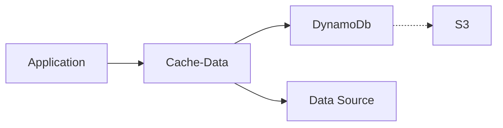

# Tutorial #2: API Gateway and Lambda using Cache-Data (Node)

This tutorial is in two parts and covers many best practices used for production applications. Therefore, it is much longer than other tutorials. However, all following tutorials will utilize these concepts without necessarily calling them out.

> This tutorial is THE tutorial that bridges learning and application development for production environments. It is also THE tutorial for working with the @63klabs/cache-data npm package.

## Prerequisite

An understanding of concepts outlined in previous tutorials is required.

If you have not read through the [introductory README](../../README.md), or have not completed the [previous tutorials](../../README.md#tutorials), please do so before proceeding. Each tutorial builds on concepts from the previous and is not something to just "jump into."

## Objective

By the end of this tutorial you will be able to deploy a production-ready application that utilizes a separate storage stack with S3 and DynamoDb resources for use with a Lambda application stack that provides an API endpoint for a web service that incorporates caching, monitoring, deployment tests, and production capabilities.

### Part I Objectives

1. Stack Organization: "Separation of Stacks"
2. Create a storage stack with S3 and DynamoDb resources
3. Caching using DynamoDb table and an S3 bucket
4. Cache security

### Part II Objectives

1. Seed repository and create pipeline
2. Check endpoint and cache in DynamoDb
3. Understand components of application template
   1. Metadata
   2. Parameters and overrides
   3. Utilize conditionals for resource creation and properties
   4. Mapping
   5. Using `ImportValue` instead of parameters
4. Understand the components of build process
   1. Secure secrets using SSM Parameter Store
   2. Installs and scripts
5. Inspect and utilize various `cache` and `tools` features of the @63klabs/cache-data npm package
   1. Configuration
   2. Caching
   3. Debug logs and Timer
6. Identify components of the application structure
   1. Routes
   2. Request
   3. Controller
   4. Service
   5. View
   6. Models
   7. Response
7. Dive deeper into controllers, services, models, and views
   1. Implement a copy of Example components for the Games API (using CachedData)
   2. Implement a basic, direct call to an endpoint with no caching (8 Ball)
   3. Implement a Data Access Object with an api key behind caching (Weather)
   4. Static and Test data
   5. Create a Controller and View utilizing the three data services
8. Trace logs using X-Ray
9. Monitor performance using Lambda Insights and CloudWatch Dashboards
10. Create Alarms and Rollbacks
11. Create unit tests and automate pre-deployment testing
12. Automate post-deployment testing

> Note: This tutorial uses the Prefix `acme` and profile `acme-dev`. Be sure to replace with your own requirements. Also, if your organization requires you to add your username or name to the front of the repository name or ProjectID you may do so to keep the account tidy.

## Part I: Storage Stack using S3 and Dynamo DB for Cache-Data

> This first part uses an Atlantis template for deploying an S3 bucket and DynamoDb table for storing cached data.

### 1. Stack Organization: "Separation of Stacks"

Previously we used the `config.py` and `deploy.py` scripts in the SAM Config repository to create the SAM configuration and deploy an application pipeline.

The config and deploy scripts can also deploy CloudFormation stacks that maintain other infrastructure such as storage, network, and even IAM roles and policies.

These are manual processes as they don't occur often and don't require a deployment pipeline like an application does. They have a different **lifecycle** than your application, and are often handled and **owned** by those in roles outside of application developers. This follows the "Separation of Stacks" best practice to [Organize your stacks by lifecycle and ownership](https://docs.aws.amazon.com/AWSCloudFormation/latest/UserGuide/best-practices.html#organizingstacks). 

### 2. Create a cache storage stack with S3 and DynamoDb resources

> An AWS account can only have ONE cache storage stack per Prefix, per region. Check the CloudFormation stacks via the AWS Web Console for the existence of `<prefix>-cache-data-storage`. If it already exists, read through but skip the act of configuring and deploying this solution. We will visit storage stacks again in a later tutorial.

If `<prefix>-cache-data-storage` does not exist as a CloudFormation stack, in the SAM Config repository, create the storage configuration for cache-data.

> Note: If you have not cloned your organization's SAM Config repository to your local machine, refer to the [Introductory Read me: SAM Configuration Repository](../../README.md#sam-configuration-repository)

```bash
./cli/config.py storage acme cache-data --profile acme-dev
```
> Note: Instead of a `pipeline` we are creating a `storage` stack as noted with the first argument. Also note that since this is shared among all applications for a prefix in a region, and cache-data automatically partitions data between applications and their instances when storing, we do not supply a stage identifier (`StageId`) or specific application (`ProjectId`).

When prompted to select a template you'll see a list of templates that differs from before. Instead of pipelines, since you provided the `storage` type in the script arguments, it will display available storage templates.

Choose `template-storage-cache-data.yml` since it is an already provided template specific for use with the `63klabs/cache-data` NPM package.

After finishing the prompts, copy, paste and execute the deploy command from the config output.

```bash
# Perform this command in the SAM Config Repo
./cli/deploy.py storage acme cache-data default --profile acme-dev
```

After a successful deployment, be sure to commit and push your configuration to the SAM config repository.

### 3. Caching using DynamoDb table and an S3 bucket

Why are we using both DynamoDb and S3?

First, let's explore how the cache works. We'll get into the actual code and implementation later, but for now we'll just give an overview.

Cache-Data is a **backend** cache, separate from the **frontend** cache you may use via a Content Delivery Network (CDN) offered through CloudFront or even API Gateway.

- **Front-end** caching caches the requests coming in from your users.
- **Back-end** caching caches the requests your _application_ makes to back-end data sources.

Suppose you have a company directory API for use on a public-facing website. Most likely the directory information only changes nightly. When a visitor hits your company directory page, it calls the API. If you put caching in front of your API then it can handle the requests for a time period without hitting yor backend and incurring costs.

Now, suppose the company directory has advanced filtering for visitors to quickly find the right staff person. You can still present the full list from the front-end cache, but as the user selects different filtering options a request may need to be made to your backend. Let's also say that the backend api (or database) that supplies your directory information is actually four separate APIs that are brought together in your custom web service endpoint which is accessed by the front-end site.

Your API can keep a cache of directory information, only making a request to the backend data source when the cache expires. It can then handle requests by filtering against the cached data.

The idea of a cache is pretty simple, a request comes in to your web service. Your web service needs data from a source. First it checks the cache to see if that data already exists. If it doesn't then it makes a call to the remote source. The benefits of a cache is this: accessing a cache in DynamoDb might only take 100ms whereas accessing from the original source could take 2 seconds or longer depending on network traffic and how quickly the data source responds. (We all know the slow databases, apis, and websites in our lives!)

Using a cache for backend data also helps us be good netizens by not making too many requests, overloading backend systems, and going over usage limits.

The cache-data package calculates a hash of each request based on authentication, endpoint, parameters, and any header information we specify. It then sends that hash as a record identifier to DynamoDb. If DynamoDb has a record for that hash it returns it. If not, it returns nothing and cache-data goes to the source. After it goes to the source it saves a copy in the DynamoDb cache and returns the result to your application.

You application isn't aware of what is in the cache. Accessing the cache in DynamoDb, figuring out expiration dates, error handling, and determining when to call the endpoint is all done in cache-data.

So DynamoDb is used to store the cache, what is S3 used for?

Well, the simple answer is we don't want to bog DynamoDb down with **large** responses from our backend data sources. To keep DynamoDb happy we only store data less than about 20KB in size. If a response from a remote data source is larger, we will store the data in S3, while creating a pointer in DynamoDb to S3. That way when your application makes a request for a 20MB directory, cache-data checks DynamoDb, sees the pointer to S3 and then grabs it from S3. Doesn't this add another 20ms? Yes, but if we have hundreds of 20MB DynamoDb records you'll get a nasty performance hit anyway. And requesting 20MB from a remote endpoint isn't quick either. Caching and optimizing retrieval is the way to go.



### 4. Cache security

The storage template for cache-data already has data encryption for DynamoDb and S3 enabled at the resource level.

As an added layer of security, a per-application, per-instance encryption key is automatically generated during deployment and stored in SSM Parameter store. That encryption key is then used by your application to decrypt the data. It is important that only trusted applications (and users) have access to SSM Parameter store. Utilize the principle of least privilege.

By default, your Lambda function has a execution role that only allows read access to its own SSM Parameters.

The method in which the data is encrypted, and the hash identifier is generated, also ensures that each application can access only it's own data. For example, if you have two separate applications, each sending the same request to your directory data source, there will be two separate cache records, one for each application. Also, each instance (test, beta, prod) of your application has it's own keys and hash id calculation which further separates the caches.

This means that if you have two application, each with a test, beta, and production instance, you could have the same data stored 6 times. However, this is expected and best practice as you don't want to share access among systems and deployments.

Also, the DynamoDb table and S3 bucket will automatically expire and delete cached data to free up space.

## Part II: Application Starter: 02 API Gateway with Lambda using Cache-Data (Node.js)

> Uses [Atlantis App Starter - 02 - API Gateway and Lambda using @63Klabs/Cache-Data (Node)](https://github.com/63Klabs/atlantis-starter-02-apigw-lambda-cache-data-nodejs)

Refer to the README in the app starter GitHub repository above for an overview of the code.

### 1. Seed repository and create pipeline

Using the `create_repo` script in your organization's SAM Config repository, create and seed the repository with application starter 02.

```bash
./cli/create_repo.py tutorial-games-proxy --profile acme-dev
```

Choose application starter 02 (`atlantis-starter-02-apigw-lambda-cache-data-nodejs`) when prompted.

Clone the repository to your local environment and merge the `dev` branch into the `test` branch.

In the SAM Config repository, create the pipeline for your application.

```bash
./cli/config.py pipeline acme games-proxy test --profile acme-dev
```

Copy, paste and execute the deploy command from the config output.

```bash
# Perform this command in the SAM Config Repo
./cli/deploy.py pipeline acme games-proxy test --profile acme-dev
```

After the pipeline has been created successfully, a link to the pipeline will be displayed in the Output. Follow the link to view the pipeline in the console. (You may need to log into the console first before following the link.)

Once your CloudFormation application stack has deployed, view the endpoint in your browser. You should see a list of games.

### 2. Check endpoint and cache

Hit refresh in the browser a few times. You should notice that while the first request took a second or two, the following requests are much shorter. This is because upon your first request the cache had to load from the original source. Subsequent requests only need to get the data from DynamoDb.

In the web console go to the Lambda Execution logs in CloudWatch. (There is a link in your application stacks outputs section.)

You'll notice at the very start of the logs is a `COLDSTART` indicator. You'll also notice log information about what actions your application took to fulfill the request to your browser. Some logs will include cache access information. You'll notice on the first request there wasn't a cache so it had to get it from the original source.

You'll also notice a final response log that gives information about the request and the response.

Next, we'll check out the data in the DynamoDb table. 

> Note: You may not have access to the table to view the data. If you do not have access to actually see that the cache exists, please just take my word, and your CloudWatch logs entry, as proof that the data exists.

You can get the link to the DynamoDb table either from the Cache-Data storage stack output section or by heading to DynamoDb in the web console and searching for `<prefix>-cache-data-CacheData`

When you access the table you can examine the table info and click on Explore table items. 

When you explore table items you'll see the cache records. If you click into the records you can examine the meta data, and that the data itself is encrypted.

### 3. Understand components of application template

Let's step back a moment and explore the application resources by examining the template.

#### 3.1. Metadata

TODO

#### 3.2. Parameters and overrides

TODO

#### 3.3. Utilize conditionals for resource creation and properties

TODO

#### 3.4. Mapping

TODO

#### 3.5. Using `ImportValue` instead of parameters

TODO
