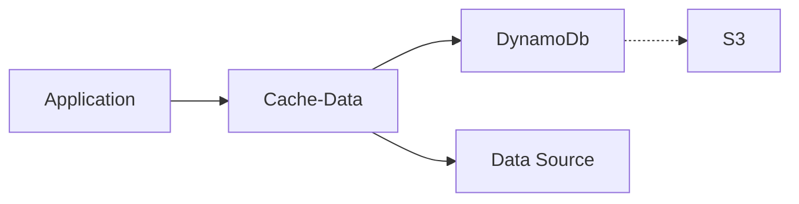

# Atlantis Tutorial 02: Part I: Storage Stack using S3 and Dynamo DB for Cache-Data

> This first part uses an Atlantis template for deploying an S3 bucket and DynamoDb table for storing cached data.

# 1. Stack Organization: "Separation of Stacks"

Previously we used the `config.py` and `deploy.py` scripts in the SAM Config repository to create the SAM configuration and deploy an application pipeline.

The config and deploy scripts can also deploy CloudFormation stacks that maintain other infrastructure such as storage, network, and even IAM roles and policies.

These are manual processes as they don't occur often and don't require a deployment pipeline like an application does. They have a different **lifecycle** than your application, and are often handled and **owned** by those in roles outside of application developers. This follows the "Separation of Stacks" best practice to [Organize your stacks by lifecycle and ownership](https://docs.aws.amazon.com/AWSCloudFormation/latest/UserGuide/best-practices.html#organizingstacks). 

# 2. Create a cache storage stack with S3 and DynamoDb resources

> An AWS account can only have ONE cache storage stack per Prefix, per region. Check the CloudFormation stacks via the AWS Web Console for the existence of `<prefix>-cache-data-storage`. If it already exists, read through but skip the act of configuring and deploying this solution. We will visit storage stacks again in a later tutorial.

If `<prefix>-cache-data-storage` does not exist as a CloudFormation stack, in the SAM Config repository, create the storage configuration for cache-data.

> Note: If you have not cloned your organization's SAM Config repository to your local machine, refer to the [Introductory Read me: SAM Configuration Repository](../../README.md#sam-configuration-repository)

```bash
./cli/config.py storage acme cache-data --profile ACME_DEV_PROFILE
```

> Note: Instead of a `pipeline` we are creating a `storage` stack as noted with the first argument. Also note that since this is shared among all applications for a prefix in a region, and cache-data automatically partitions data between applications and their instances when storing, we do not supply a stage identifier (`StageId`) or specific application (`ProjectId`).

When prompted to select a template you'll see a list of templates that differs from before. Instead of pipelines, since you provided the `storage` type in the script arguments, it will display available storage templates.

Choose `template-storage-cache-data.yml` since it is an already provided template specific for use with the `63klabs/cache-data` NPM package.

After finishing the prompts, copy, paste and execute the deploy command from the config output.

```bash
# Perform this command in the SAM Config Repo
./cli/deploy.py storage acme cache-data default --profile ACME_DEV_PROFILE
```

After a successful deployment, be sure to commit and push your configuration to the SAM config repository.

# 3. Caching using DynamoDb table and an S3 bucket

Why are we using both DynamoDb and S3?

First, let's explore how the cache works. We'll get into the actual code and implementation later, but for now we'll just give an overview.

Cache-Data is a **backend** cache, separate from the **frontend** cache you may use via a Content Delivery Network (CDN) offered through CloudFront or even API Gateway.

- **Front-end** caching caches the requests coming in from your users.
- **Back-end** caching caches the requests your _application_ makes to back-end data sources.

Suppose you have a company directory API for use on a public-facing website. Most likely the directory information only changes nightly. When a visitor hits your company directory page, it calls the API. If you put caching in front of your API then it can handle the requests for a time period without hitting yor backend and incurring costs.

Now, suppose the company directory has advanced filtering for visitors to quickly find the right staff person. You can still present the full list from the front-end cache, but as the user selects different filtering options a request may need to be made to your backend. Let's also say that the backend api (or database) that supplies your directory information is actually four separate APIs that are brought together in your custom web service endpoint which is accessed by the front-end site.

Your API can keep a cache of directory information, only making a request to the backend data source when the cache expires. It can then handle requests by filtering against the cached data.

The idea of a cache is pretty simple, a request comes in to your web service. Your web service needs data from a source. First it checks the cache to see if that data already exists. If it doesn't then it makes a call to the remote source. The benefits of a cache is this: accessing a cache in DynamoDb might only take 100ms whereas accessing from the original source could take 2 seconds or longer depending on network traffic and how quickly the data source responds. (We all know the slow databases, apis, and websites in our lives!)

Using a cache for backend data also helps us be good netizens by not making too many requests, overloading backend systems, and going over usage limits.

The cache-data package calculates a hash of each request based on authentication, endpoint, parameters, and any header information we specify. It then sends that hash as a record identifier to DynamoDb. If DynamoDb has a record for that hash it returns it. If not, it returns nothing and cache-data goes to the source. After it goes to the source it saves a copy in the DynamoDb cache and returns the result to your application.

You application isn't aware of what is in the cache. Accessing the cache in DynamoDb, figuring out expiration dates, error handling, and determining when to call the endpoint is all done in cache-data.

So DynamoDb is used to store the cache, what is S3 used for?

Well, the simple answer is we don't want to bog DynamoDb down with **large** responses from our backend data sources. To keep DynamoDb happy we only store data less than about 20KB in size. If a response from a remote data source is larger, we will store the data in S3, while creating a pointer in DynamoDb to S3. That way when your application makes a request for a 20MB directory, cache-data checks DynamoDb, sees the pointer to S3 and then grabs it from S3. Doesn't this add another 20ms? Yes, but if we have hundreds of 20MB DynamoDb records you'll get a nasty performance hit anyway. And requesting 20MB from a remote endpoint isn't quick either. Caching and optimizing retrieval is the way to go.



# 4. Cache security

The storage template for cache-data already has data encryption for DynamoDb and S3 enabled at the resource level.

As an added layer of security, a per-application, per-instance encryption key is automatically generated during deployment and stored in SSM Parameter store. That encryption key is then used by your application to decrypt the data. It is important that only trusted applications (and users) have access to SSM Parameter store. Utilize the principle of least privilege.

By default, your Lambda function has a execution role that only allows read access to its own SSM Parameters.

The method in which the data is encrypted, and the hash identifier is generated, also ensures that each application can access only it's own data. For example, if you have two separate applications, each sending the same request to your directory data source, there will be two separate cache records, one for each application. Also, each instance (test, beta, prod) of your application has it's own keys and hash id calculation which further separates the caches.

This means that if you have two applications, each with a test, beta, and production instance, you could have the same data stored 6 times. However, this is expected and best practice as you don't want to share access among systems and deployments.

Also, the DynamoDb table and S3 bucket will automatically expire and delete cached data to free up space.

# 5. Stack Outputs and Exports

The Cache-Data storage stack makes the S3 and DynamoDb resource names and ARNs available to other stacks using an Outputs Export.

This is a method in CloudFormation to create variables that can be used in any stack within an AWS account's region. This variable can then be used by other stacks to include non-static information without the necessity of providing shared resource table and bucket names as parameters to all stacks.

Another benefit of using output variables is that while a variable is in use within other stacks, the stack exporting the variable cannot be deleted. 

For example, if you deployed applications using the cache-data storage, the Cache-Data storage stack could not be deleted until those other stacks were modified to not use it. This is helpful in making sure vital resources that other applications depend on are not deleted accidentally. Also, if the value of the variable ever changes, then the stacks using the variable will need to be redeployed, which can be much easier than manually going around and updating the parameters of each stack.

While this is useful to know, and it will come in handy later, other than knowing that is where your application stack will know where to store its cached data, you don't need to know much more about stack export variables for now.

To view all exports within your account's region:

```bash
aws cloudformation list-exports --profile ACME_DEV_PROFILE
```

To view all exports for a specific stack:

```bash
aws cloudformation describe-stacks --stack-name STACK_NAME --query "Stacks[0].Outputs[?ExportName]" --profile ACME_DEV_PROFILE
```

# Part I Summary

- Stacks are organized by lifecycle and owner.
- In addition to a Pipeline and Application stack, you may manage a Storage stack.
- Storage stacks may be shared among all instances in an application, or among many applications
- Cache-Data storage uses encryption and hashing to keep data between applications and instances separate
- Keeping storage stacks separate from applications helps with the practice of stack separation and to prevent accidental data deletion
- Stacks can export variables to be used in other stacks within an account's region

[Move on to Part II](./part-02.md)
