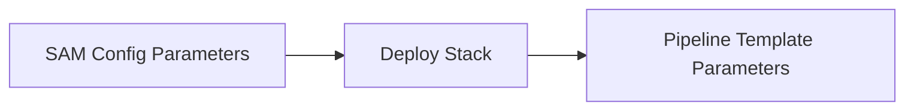
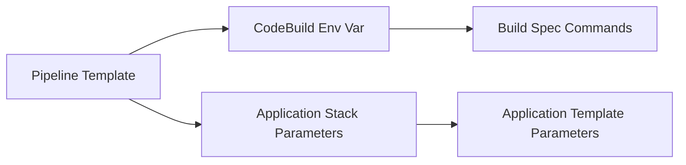
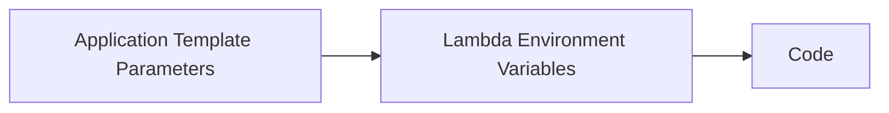

# Part II: Application Starter 02 API Gateway with Lambda using Cache-Data (Node.js)

> Uses [Atlantis App Starter - 02 - API Gateway and Lambda using @63Klabs/Cache-Data (Node)](https://github.com/63Klabs/atlantis-starter-02-apigw-lambda-cache-data-nodejs)

Refer to the README in the app starter GitHub repository above for an overview of the code.

## 1. Seed repository and create pipeline

Using the `create_repo` script in your organization's SAM Config repository, create and seed the repository with application starter 02.

```bash
./cli/create_repo.py tutorial-games-proxy --profile ACME_DEV_PROFILE
```

Choose application starter 02 (`atlantis-starter-02-apigw-lambda-cache-data-nodejs`) when prompted.

Clone the application's repository to your local environment and merge the `dev` branch into the `test` branch without making any changes.

> When staring new projects it is a good idea to start off with known, working code and get the initial "Hello" deployment working before making changes.

In the SAM Config repository, create the pipeline for your application.

```bash
./cli/config.py pipeline acme games-proxy test --profile ACME_DEV_PROFILE
```

Copy, paste and execute the deploy command from the config output.

```bash
# Perform this command in the SAM Config Repo
./cli/deploy.py pipeline acme games-proxy test --profile ACME_DEV_PROFILE
```

After the pipeline has been created successfully, a link to the pipeline will be displayed in the Output. Follow the link to view the pipeline in the console. (You may need to log into the console first before following the link.)

Once your CloudFormation application stack has deployed, view the endpoint in your browser. You should see a list of games.

## 2. Inspect Parameters and Environment Variables

Just like passing parameters or arguments into a method or function in your code, you can pass parameters and variables between AWS resources.

For example, your SAM configuration passed Parameters to your stack to use as it deployed resources for the Pipeline. You entered these in the `config.py` prompt and they were stored in the SAM config file like so:

```toml
parameter_overrides = "\"Prefix\"=\"acme\" \"ProjectId\"=\"starter-02\" \"StageId\"=\"test\" \"S3BucketNameOrgPrefix\"=\"\" \"RolePath\"=\"/sam-apps/\" \"PermissionsBoundaryArn\"=\"\" \"DeployEnvironment\"=\"TEST\" \"S3ArtifactsBucket\"=\"cf-templates-aaaaaa123-us-east-2\" \"S3StaticHostBucket\"=\"\" \"BuildSpec\"=\"application-infrastructure/buildspec.yml\" \"ParameterStoreHierarchy\"=\"/sam-apps/\" \"AlarmNotificationEmail\"=\"chad@63klabs.net\" \"Repository\"=\"acme-02-starter\" \"RepositoryBranch\"=\"test\""
```

When the stack was deployed it used these parameters to make decisions, name resources, and even pass on.



The pipeline template defines Environment Variables for use during the build process and additional parameters to pass to the application stack during deployment. These values may be direct parameter values that were passed into the pipeline template or other values.

```yaml
# Relevant code from template-pipeline.yml
# Full template: https://github.com/63Klabs/atlantis-cfn-template-repo-for-serverless-deployments/blob/main/templates/v2/pipeline/template-pipeline.yml

Resources:

  # ....

  CodeBuildProject:
    Type: AWS::CodeBuild::Project
	Properties:
	  Environment:
	  	# These environment variables are available for use by bash commands in your buildspec
        EnvironmentVariables:
        - Name: AWS_PARTITION
          Value: !Ref 'AWS::Partition'
        - Name: AWS_REGION
          Value: !Ref 'AWS::Region'
		  # ...
		- Name: ROLE_PATH
          Value: !Ref 'RolePath'
        - Name: PERMISSIONS_BOUNDARY_ARN
          Value: !Ref 'PermissionsBoundaryArn'
        - Name: NODE_ENV
          Value: "production"

  # ...
  ProjectPipeline:
    Type: AWS::CodePipeline::Pipeline
	Properties:
	  Stages:
	  # ...
      -
        Name: Deploy
        Actions:
        -
		Name: GenerateChangeSet
		Configuration:
			# These are passed to your application stack
			ParameterOverrides: !Sub '{
				"Prefix": "${Prefix}",
				"ProjectId": "${ProjectId}",
				"StageId": "${StageId}",
				"S3BucketNameOrgPrefix": "${S3BucketNameOrgPrefix}",
				"RolePath": "${RolePath}",
				"DeployEnvironment": "${DeployEnvironment}",
				"ParameterStoreHierarchy": "${ParameterStoreHierarchy}${DeployEnvironment}/${Prefix}-${ProjectId}-${StageId}/",
				"DeployRole": "${CodeDeployServiceRole.Arn}",
				"AlarmNotificationEmail": "${AlarmNotificationEmail}",
				"PermissionsBoundaryArn": "${PermissionsBoundaryArn}"
				}'
```



> You can override these values, and add additional parameter values for your Application stack by modifying the `template-configuration.yml` file in your application infrastructure directory.

Your application stack also passes Environment variables to your Lambda function:

```yaml
# application-infrastructure/template.yml

Resources:
  AppFunction:
    Type: AWS::Serverless::Function
    Properties:
	  Environment:
      Variables:
        NODE_ENV: "production"
        DEPLOY_ENVIRONMENT: !Ref DeployEnvironment
        LOG_LEVEL: !If [ IsProduction, "0", "5"]
        PARAM_STORE_PATH: !Ref ParameterStoreHierarchy 
		CACHE_DATA_TIME_ZONE_FOR_INTERVAL: !Ref CacheDataTimeZoneForInterval 
        CACHE_DATA_AWS_X_RAY_ON: true
        CACHE_DATA_USE_TOOLS_HASH_METHOD: true
```



Which you can then use as such:

```js
// Node
const my_var = process.env.LOG_LEVEL;
```

```py
# Python
import os
my_var = os.environ.get('LOG_LEVEL')
```

Understanding how these values are passed from SAM config, to the Pipeline stack, to CodeBuild, to the Application Stack, and to your Lambda function is essential for troubleshooting and getting the most out of existing values.

Here are the AWS CLI commands to list environment variables and parameters for various resources:

### CodeBuild Project Environment Variables

```bash
aws codebuild batch-get-projects --names CODEBUILD_PROJECT_NAME | jq '.projects[0].environment.environmentVariables' --profile ACME_DEV_PROFILE
```

Replace `CODEBUILD_PROJECT_NAME` with the CodeBuild resource name. (You can get this from the Resources section of your Pipeline stack)

You can also view these values through the AWS Web console by going to CodePipeline, clicking on the CodeBuild link in your pipeline flowchart, and selecting the Environment Variables tab.

### CloudFormation Stack Parameters

```bash
aws cloudformation describe-stacks --stack-name STACK_NAME | jq '.Stacks[0].Parameters' --profile ACME_DEV_PROFILE
```

You can also view these values through the AWS Web console by going to CloudFormation, selecting a stack, and opening the Parameters tab.

### Lambda Function Environment Variables

```bash
aws lambda get-function-configuration --function-name FUNCTION_NAME | jq '.Environment.Variables' --profile ACME_DEV_PROFILE
```

You can also view these values through the AWS Web console by going to Lambda, selecting the Lambda function, and opening the Configuration tab, and clicking on Environment Variables from the left-hand side.

## 3. Check endpoint and cache

Going back to your application endpoint, hit refresh in the browser a few times. You should notice that while the first request took a second or two, the following requests are much shorter. This is because upon your first request the cache had to load from the original source. Subsequent requests only need to get the data from DynamoDb.

In the web console go to the Lambda Execution logs in CloudWatch. (There is a link in your application stacks outputs section.)

You'll notice at the very start of the logs is a `COLDSTART` indicator. You'll also notice log information about what actions your application took to fulfill the request to your browser. Some logs will include cache access information. You'll notice on the first request there wasn't a cache so it had to get it from the original source.

You'll also notice a final response log that gives information about the request and the response.

Next, we'll check out the data in the DynamoDb table. 

> Note: You may not have access to the table to view the data. If you do not have access to actually see that the cache exists, please just take my word, and your CloudWatch logs entry, as proof that the data exists.

You can get the link to the DynamoDb table either from the Cache-Data storage stack output section or by heading to DynamoDb in the web console and searching for `<prefix>-cache-data-CacheData`

When you access the table you can examine the table info and click on Explore table items. 

When you explore table items you'll see the cache records. If you click into the records you can examine the meta data, and that the data itself is encrypted.

## 3. Understanding the components of the application template

Let's step back a moment and explore the application resources by examining the template.

For your convenience, the template provides a link to AWS Documentation regarding each major section for you to learn more.

Additional resource: [AWS CloudFormation: template sections](https://docs.aws.amazon.com/AWSCloudFormation/latest/UserGuide/template-anatomy.html)

### Metadata

The Metadata section is used by the AWS Web Console and Atlantis config.py to display the parameters in a particular order. It is used to group like parameters together when being prompted for values for the CloudFormation stack.

```yaml
Metadata:
  AWS::CloudFormation::Interface:
    ParameterGroups:
      - 
        Label:
          default: "Application Resource Naming"
        Parameters:
          - Prefix
          - ProjectId
          # ....
      -
        Label:
          default: "Deployment Environment Information"
        Parameters:
          - DeployEnvironment
          - DeployRole
          - FunctionGradualDeploymentType
          - AlarmNotificationEmail
          # ....
```

If you add additional parameters, or remove others, be sure to update the Metadata section.

Learn more: [AWS CloudFormation Templates: Metadata Section](https://docs.aws.amazon.com/AWSCloudFormation/latest/UserGuide/aws-resource-cloudformation-interface.html)

### Parameters and Overrides

When you created the pipeline stack in the CLI, you were prompted for parameter values. 

However, when your application stack was deployed by the pipeline, you were not prompted for any values since it was done through automation without intervention. So, where did these values come from?

As explained earlier, some were passed on by the pipeline through the deployment phase as there are several parameters that are shared by both the pipeline and application, such as `Prefix`, `ProjectId`, `PermissionBoundaryArn`, and more.

The next method of setting the parameter values, is by placing them in the `template-configuration.json` file which we will examine later when we talk about the build process.

Finally, for those that were not explicitly set by the pipeline, or template config file, the default values set by the parameter definition are used.

Learn more: [AWS CloudFormation Templates: Parameters Section](https://docs.aws.amazon.com/AWSCloudFormation/latest/UserGuide/parameters-section-structure.html)

### Mappings

Mappings allow you to conditionally apply a value based upon another value.

For example, in the template we are using, the Lambda Insights and Parameter and Secrets Extension layer arns will change depending upon which region we are deploying in. Instead of hardcoding, we can make it easier to deploy among multiple regions by mapping a particular Lambda layer arn to the region we are deploying in.

We don't need to request this via a parameter or hard code it.

```yaml
Mappings:

  LambdaParamSecretsX86:
    us-east-1:
      ExtArn: "arn:aws:lambda:us-east-1:177933569100:layer:AWS-Parameters-and-Secrets-Lambda-Extension:18"
    us-east-2:
      ExtArn: "arn:aws:lambda:us-east-2:590474943231:layer:AWS-Parameters-and-Secrets-Lambda-Extension:22"
    us-west-1:
      ExtArn: "arn:aws:lambda:us-west-1:997803712105:layer:AWS-Parameters-and-Secrets-Lambda-Extension:18"
    us-west-2:
      ExtArn: "arn:aws:lambda:us-west-2:345057560386:layer:AWS-Parameters-and-Secrets-Lambda-Extension:18"

Resources:
  AppFunction:
    Type: AWS::Serverless::Function
    Properties:
      Layers:
        - !FindInMap [LambdaParamSecretsX86, !Ref 'AWS::Region', ExtArn]
```

Learn more:

- [AWS CloudFormation Templates: Mappings Section](https://docs.aws.amazon.com/AWSCloudFormation/latest/UserGuide/mappings-section-structure.html)
- [AWS CloudFormation Templates: `Fn::FindInMap`](https://docs.aws.amazon.com/AWSCloudFormation/latest/TemplateReference/intrinsic-function-reference-findinmap.html)

### Conditions

Portions of templates should be re-usable and adapt to various settings especially when being deployed in different environments such as `TEST` and `PROD`.

CloudFormation does not allow for using logical operators such as `Equals` in `Fn::If`, it only allow for boolean values to be used. Therefore all evaluations must be done in the Conditions section.

The conditions section is where you can evaluate mappings and parameters and produce boolean variables to be used in your template.

In the template you are using, you'll notice many are commented out. This is because some linters will complain about unused variables. They are included so that you can easily comment them out when you have use for them.

In the example below you'll notice the use of `IsProduction` and `CreateAlarms` to determine how the Lambda function should be deployed.

```yaml
Conditions:
  IsProduction: !Equals [!Ref DeployEnvironment, "PROD"]
  # IsNotProduction: !Not [!Equals [!Ref DeployEnvironment, "PROD"]]
  # IsTest: !Equals [!Ref DeployEnvironment, "TEST"]
  CreateProdResources: !Equals [!Ref DeployEnvironment, "PROD"]
  CreateAlarms: !Equals [!Ref DeployEnvironment, "PROD"]
  HasPermissionsBoundaryArn: !Not [!Equals [!Ref PermissionsBoundaryArn, ""]]

  AppFunction:
    Type: AWS::Serverless::Function
    Properties:
      DeploymentPreference:
        Enabled: !If [ IsProduction, True,  False] #Gradual deployment only if in production so DEV and TEST aren't hindered
        Type: !If [ IsProduction, !Ref FunctionGradualDeploymentType, "AllAtOnce"]
        Alarms: # Alarms cost money. Only deploy in PROD environments
          Fn::If:
            - CreateAlarms
            - - !Ref AppFunctionErrorsAlarm
            - - !Ref 'AWS::NoValue'
```

Note the use of `AWS::NoValue`. Some CloudFormation properties require a value such as a string, boolean, or array. If you are using a conditional to set a property and you do not have use for the property if the condition does not warrant it, you can pass `AWS::NoValue`. This effectively set the value to `null` and CloudFormation will then remove the property from the template when deploying.

In the above example, `Alarms` requires an array and will not accept an empty array or `""`. If we do not need to create an alarm, the If statement will produce the following `Alarms: null` which will then be pruned from deployment.

> `Fn:If` statements are If/Else, you need a value for both the If and Else. If you only need an `If` but not an `Else` (or vice versa), use `!Ref 'AWS::NoValue'` as the "do nothing" or "null" value.

Learn more:

- [AWS CloudFormation Templates: Conditions Section](https://docs.aws.amazon.com/AWSCloudFormation/latest/UserGuide/conditions-section-structure.html)
- [AWS CloudFormation Condition Functions](https://docs.aws.amazon.com/AWSCloudFormation/latest/UserGuide/intrinsic-function-reference-conditions.html)

### Globals

TODO

[AWS CloudFormation Templates: Globals Section](https://docs.aws.amazon.com/serverless-application-model/latest/developerguide/sam-specification-template-anatomy-globals.html)

### Resources

TODO

TODO: Serverless vs Lambda and API Gateway

[AWS CloudFormation Templates: Resources Section](https://docs.aws.amazon.com/AWSCloudFormation/latest/UserGuide/resources-section-structure.html)

### Using `ImportValue` instead of parameters

TODO

[AWS CloudFormation Templates: `Fn::ImportValue](https://docs.aws.amazon.com/AWSCloudFormation/latest/TemplateReference/intrinsic-function-reference-importvalue.html)


### Using `Fn::Transform` and `AWS::Include`

The `Fn::Transform` intrinsic function in AWS CloudFormation specifies a macro to perform custom processing on a part of a stack template. Macros allow for advanced template transformations beyond standard CloudFormation functionality.

The `AWS::Include` transform macro allows you to separate out, or re-use, portions of your templates.

If you re-use an S3 bucket or DynamoDb definition among several templates you can store that template in S3.

The application infrastructure template separates out the definitions for `Dashboard` and `Swagger` to make the overall template more manageable. Instead of S3, these are included in the same application infrastructure directory so that they can be customized to suit your application's needs. If you examine the `dashboard` and `swagger` template files you'll see they are quite lengthy, written in json and would clutter up the main template.

```yaml
Resources:
  WebApi:
    Type: AWS::Serverless::Api
    Properties: 
      DefinitionBody:
        "Fn::Transform":
          Name: "AWS::Include"
          Parameters:
            Location: ./template-swagger.yml

  Fn::Transform:
    Name: AWS::Include
    Parameters:
      Location: ./template-dashboard.yml
```

Learn More: [AWS CloudFormation Templates: Transform Include](https://docs.aws.amazon.com/AWSCloudFormation/latest/TemplateReference/transform-aws-include.html)

### Outputs

TODO

[AWS CloudFormation Templates: Outputs Section](https://docs.aws.amazon.com/AWSCloudFormation/latest/UserGuide/outputs-section-structure.html)

## 5. Identify the components of build process

TODO

### Secure secrets using SSM Parameter Store

TODO

### Installs and scripts

TODO

## Part II Summary

[Move on to Part III](./part-03.md)
