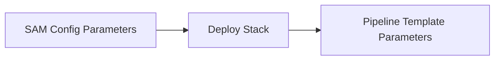
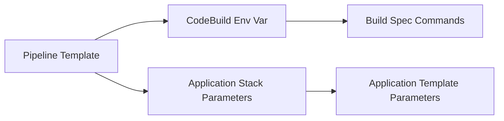
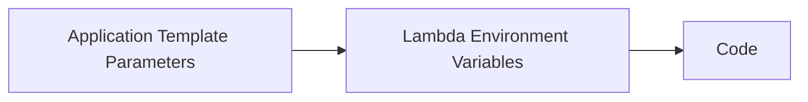

# Part II: Application Starter 02 API Gateway with Lambda using Cache-Data (Node.js)

> Uses [Atlantis App Starter - 02 - API Gateway and Lambda using @63Klabs/Cache-Data (Node)](https://github.com/63Klabs/atlantis-starter-02-apigw-lambda-cache-data-nodejs)

Refer to the README in the app starter GitHub repository above for an overview of the code.

## 1. Seed repository and create pipeline

Using the `create_repo` script in your organization's SAM Config repository, create and seed the repository with application starter 02.

```bash
./cli/create_repo.py tutorial-games-proxy --profile ACME_DEV_PROFILE
```

Choose application starter 02 (`atlantis-starter-02-apigw-lambda-cache-data-nodejs`) when prompted.

Clone the application's repository to your local environment and merge the `dev` branch into the `test` branch without making any changes.

> When staring new projects it is a good idea to start off with known, working code and get the initial "Hello" deployment working before making changes.

In the SAM Config repository, create the pipeline for your application.

```bash
./cli/config.py pipeline acme games-proxy test --profile ACME_DEV_PROFILE
```

Copy, paste and execute the deploy command from the config output.

```bash
# Perform this command in the SAM Config Repo
./cli/deploy.py pipeline acme games-proxy test --profile ACME_DEV_PROFILE
```

After the pipeline has been created successfully, a link to the pipeline will be displayed in the Output. Follow the link to view the pipeline in the console. (You may need to log into the console first before following the link.)

Once your CloudFormation application stack has deployed, view the endpoint in your browser. You should see a list of games.

## 2. Inspect Parameters and Environment Variables

Just like passing parameters or arguments into a method or function in your code, you can pass parameters and variables between AWS resources.

For example, your SAM configuration passed Parameters to your stack to use as it deployed resources for the Pipeline. You entered these in the `config.py` prompt and they were stored in the SAM config file like so:

```toml
parameter_overrides = "\"Prefix\"=\"acme\" \"ProjectId\"=\"starter-02\" \"StageId\"=\"test\" \"S3BucketNameOrgPrefix\"=\"\" \"RolePath\"=\"/sam-apps/\" \"PermissionsBoundaryArn\"=\"\" \"DeployEnvironment\"=\"TEST\" \"S3ArtifactsBucket\"=\"cf-templates-aaaaaa123-us-east-2\" \"S3StaticHostBucket\"=\"\" \"BuildSpec\"=\"application-infrastructure/buildspec.yml\" \"ParameterStoreHierarchy\"=\"/sam-apps/\" \"AlarmNotificationEmail\"=\"chad@63klabs.net\" \"Repository\"=\"acme-02-starter\" \"RepositoryBranch\"=\"test\""
```

When the stack was deployed it used these parameters to make decisions, name resources, and even pass on.



The pipeline template defines Environment Variables for use during the build process and additional parameters to pass to the application stack during deployment. These values may be direct parameter values that were passed into the pipeline template or other values.

```yaml
# Relevant code from template-pipeline.yml
# Full template: https://github.com/63Klabs/atlantis-cfn-template-repo-for-serverless-deployments/blob/main/templates/v2/pipeline/template-pipeline.yml

Resources:

  # ....

  CodeBuildProject:
    Type: AWS::CodeBuild::Project
	Properties:
	  Environment:
	  	# These environment variables are available for use by bash commands in your buildspec
        EnvironmentVariables:
        - Name: AWS_PARTITION
          Value: !Ref 'AWS::Partition'
        - Name: AWS_REGION
          Value: !Ref 'AWS::Region'
		  # ...
		- Name: ROLE_PATH
          Value: !Ref 'RolePath'
        - Name: PERMISSIONS_BOUNDARY_ARN
          Value: !Ref 'PermissionsBoundaryArn'
        - Name: NODE_ENV
          Value: "production"

  # ...
  ProjectPipeline:
    Type: AWS::CodePipeline::Pipeline
	Properties:
	  Stages:
	  # ...
      -
        Name: Deploy
        Actions:
        -
		Name: GenerateChangeSet
		Configuration:
			# These are passed to your application stack
			ParameterOverrides: !Sub '{
				"Prefix": "${Prefix}",
				"ProjectId": "${ProjectId}",
				"StageId": "${StageId}",
				"S3BucketNameOrgPrefix": "${S3BucketNameOrgPrefix}",
				"RolePath": "${RolePath}",
				"DeployEnvironment": "${DeployEnvironment}",
				"ParameterStoreHierarchy": "${ParameterStoreHierarchy}${DeployEnvironment}/${Prefix}-${ProjectId}-${StageId}/",
				"DeployRole": "${CodeDeployServiceRole.Arn}",
				"AlarmNotificationEmail": "${AlarmNotificationEmail}",
				"PermissionsBoundaryArn": "${PermissionsBoundaryArn}"
				}'
```



> You can override these values, and add additional parameter values for your Application stack by modifying the `template-configuration.yml` file in your application infrastructure directory.

Your application stack also passes Environment variables to your Lambda function:

```yaml
# application-infrastructure/template.yml

Resources:
  AppFunction:
    Type: AWS::Serverless::Function
    Properties:
	  Environment:
      Variables:
        NODE_ENV: "production"
        DEPLOY_ENVIRONMENT: !Ref DeployEnvironment
        LOG_LEVEL: !If [ IsProduction, "0", "5"]
        PARAM_STORE_PATH: !Ref ParameterStoreHierarchy 
		CACHE_DATA_TIME_ZONE_FOR_INTERVAL: !Ref CacheDataTimeZoneForInterval 
        CACHE_DATA_AWS_X_RAY_ON: true
        CACHE_DATA_USE_TOOLS_HASH_METHOD: true
```



Which you can then use as such:

```js
// Node
const my_var = process.env.LOG_LEVEL;
```

```py
# Python
import os
my_var = os.environ.get('LOG_LEVEL')
```

Understanding how these values are passed from SAM config, to the Pipeline stack, to CodeBuild, to the Application Stack, and to your Lambda function is essential for troubleshooting and getting the most out of existing values.

Here are the AWS CLI commands to list environment variables and parameters for various resources:

### CodeBuild Project Environment Variables

```bash
aws codebuild batch-get-projects --names CODEBUILD_PROJECT_NAME | jq '.projects[0].environment.environmentVariables' --profile ACME_DEV_PROFILE
```

Replace `CODEBUILD_PROJECT_NAME` with the CodeBuild resource name. (You can get this from the Resources section of your Pipeline stack)

You can also view these values through the AWS Web console by going to CodePipeline, clicking on the CodeBuild link in your pipeline flowchart, and selecting the Environment Variables tab.

### CloudFormation Stack Parameters

```bash
aws cloudformation describe-stacks --stack-name STACK_NAME | jq '.Stacks[0].Parameters' --profile ACME_DEV_PROFILE
```

You can also view these values through the AWS Web console by going to CloudFormation, selecting a stack, and opening the Parameters tab.

### Lambda Function Environment Variables

```bash
aws lambda get-function-configuration --function-name FUNCTION_NAME | jq '.Environment.Variables' --profile ACME_DEV_PROFILE
```

You can also view these values through the AWS Web console by going to Lambda, selecting the Lambda function, and opening the Configuration tab, and clicking on Environment Variables from the left-hand side.

## 3. Check endpoint and cache

Going back to your application endpoint, hit refresh in the browser a few times. You should notice that while the first request took a second or two, the following requests are much shorter. This is because upon your first request the cache had to load from the original source. Subsequent requests only need to get the data from DynamoDb.

In the web console go to the Lambda Execution logs in CloudWatch. (There is a link in your application stacks outputs section.)

You'll notice at the very start of the logs is a `COLDSTART` indicator. You'll also notice log information about what actions your application took to fulfill the request to your browser. Some logs will include cache access information. You'll notice on the first request there wasn't a cache so it had to get it from the original source.

You'll also notice a final response log that gives information about the request and the response.

Next, we'll check out the data in the DynamoDb table. 

> Note: You may not have access to the table to view the data. If you do not have access to actually see that the cache exists, please just take my word, and your CloudWatch logs entry, as proof that the data exists.

You can get the link to the DynamoDb table either from the Cache-Data storage stack output section or by heading to DynamoDb in the web console and searching for `<prefix>-cache-data-CacheData`

When you access the table you can examine the table info and click on Explore table items. 

When you explore table items you'll see the cache records. If you click into the records you can examine the meta data, and that the data itself is encrypted.

## 3. Understanding the components of the application template

Let's step back a moment and explore the application resources by examining the template.

For your convenience, the template provides a link to AWS Documentation regarding each major section for you to learn more.

Additional resource: [AWS CloudFormation: template sections](https://docs.aws.amazon.com/AWSCloudFormation/latest/UserGuide/template-anatomy.html)

> Below you will find an explanation of sections and resource properties in the template file. Either follow along with the template in your application repository, or view the original [`template.yml` file in the Application Starter 02 repository](https://github.com/63Klabs/atlantis-starter-02-apigw-lambda-cache-data-nodejs/blob/main/application-infrastructure/template.yml).

### Metadata

The Metadata section is used by the AWS Web Console and Atlantis config.py to display the parameters in a particular order. It is used to group like parameters together when being prompted for values for the CloudFormation stack.

```yaml
Metadata:
  AWS::CloudFormation::Interface:
    ParameterGroups:
      - 
        Label:
          default: "Application Resource Naming"
        Parameters:
          - Prefix
          - ProjectId
          # ....
      -
        Label:
          default: "Deployment Environment Information"
        Parameters:
          - DeployEnvironment
          - DeployRole
          - FunctionGradualDeploymentType
          - AlarmNotificationEmail
          # ....
```

If you add additional parameters, or remove others, be sure to update the Metadata section.

Learn more: [AWS CloudFormation Templates: Metadata Section](https://docs.aws.amazon.com/AWSCloudFormation/latest/UserGuide/aws-resource-cloudformation-interface.html)

### Parameters and Overrides

When you created the pipeline stack in the CLI, you were prompted for parameter values. 

However, when your application stack was deployed by the pipeline, you were not prompted for any values since it was done through automation without intervention. So, where did these values come from?

As explained earlier, some were passed on by the pipeline through the deployment phase as there are several parameters that are shared by both the pipeline and application, such as `Prefix`, `ProjectId`, `PermissionBoundaryArn`, and more.

The next method of setting the parameter values, is by placing them in the `template-configuration.json` file which we will examine later when we talk about the build process.

Finally, for those that were not explicitly set by the pipeline, or template config file, the default values set by the parameter definition are used.

Learn more: [AWS CloudFormation Templates: Parameters Section](https://docs.aws.amazon.com/AWSCloudFormation/latest/UserGuide/parameters-section-structure.html)

### Mappings

Mappings allow you to conditionally apply a value based upon another value.

For example, in the template we are using, the Lambda Insights and Parameter and Secrets Extension layer arns will change depending upon which region we are deploying in. Instead of hardcoding, we can make it easier to deploy among multiple regions by mapping a particular Lambda layer arn to the region we are deploying in.

We don't need to request this via a parameter or hard code it.

```yaml
Mappings:

  LambdaParamSecretsX86:
    us-east-1:
      ExtArn: "arn:aws:lambda:us-east-1:177933569100:layer:AWS-Parameters-and-Secrets-Lambda-Extension:18"
    us-east-2:
      ExtArn: "arn:aws:lambda:us-east-2:590474943231:layer:AWS-Parameters-and-Secrets-Lambda-Extension:22"
    us-west-1:
      ExtArn: "arn:aws:lambda:us-west-1:997803712105:layer:AWS-Parameters-and-Secrets-Lambda-Extension:18"
    us-west-2:
      ExtArn: "arn:aws:lambda:us-west-2:345057560386:layer:AWS-Parameters-and-Secrets-Lambda-Extension:18"

Resources:
  AppFunction:
    Type: AWS::Serverless::Function
    Properties:
      Layers:
        - !FindInMap [LambdaParamSecretsX86, !Ref 'AWS::Region', ExtArn]
```

Learn more:

- [AWS CloudFormation Templates: Mappings Section](https://docs.aws.amazon.com/AWSCloudFormation/latest/UserGuide/mappings-section-structure.html)
- [AWS CloudFormation Templates: `Fn::FindInMap`](https://docs.aws.amazon.com/AWSCloudFormation/latest/TemplateReference/intrinsic-function-reference-findinmap.html)

### Conditions

Portions of templates should be re-usable and adapt to various settings especially when being deployed in different environments such as `TEST` and `PROD`.

CloudFormation does not allow for using logical operators such as `Equals` in `Fn::If`, it only allow for boolean values to be used. Therefore all evaluations must be done in the Conditions section.

The conditions section is where you can evaluate mappings and parameters and produce boolean variables to be used in your template.

In the template you are using, you'll notice many are commented out. This is because some linters will complain about unused variables. They are included so that you can easily comment them out when you have use for them.

In the example below you'll notice the use of `IsProduction` and `CreateAlarms` to determine how the Lambda function should be deployed.

```yaml
Conditions:
  IsProduction: !Equals [!Ref DeployEnvironment, "PROD"]
  # IsNotProduction: !Not [!Equals [!Ref DeployEnvironment, "PROD"]]
  # IsTest: !Equals [!Ref DeployEnvironment, "TEST"]
  CreateProdResources: !Equals [!Ref DeployEnvironment, "PROD"]
  CreateAlarms: !Equals [!Ref DeployEnvironment, "PROD"]
  HasPermissionsBoundaryArn: !Not [!Equals [!Ref PermissionsBoundaryArn, ""]]

  AppFunction:
    Type: AWS::Serverless::Function
    Properties:
      DeploymentPreference:
        Enabled: !If [ IsProduction, True,  False] #Gradual deployment only if in production so DEV and TEST aren't hindered
        Type: !If [ IsProduction, !Ref FunctionGradualDeploymentType, "AllAtOnce"]
        Alarms: # Alarms cost money. Only deploy in PROD environments
          Fn::If:
            - CreateAlarms
            - - !Ref AppFunctionErrorsAlarm
            - - !Ref 'AWS::NoValue'
```

Note the use of `AWS::NoValue`. Some CloudFormation properties require a value such as a string, boolean, or array. If you are using a conditional to set a property and you do not have use for the property if the condition does not warrant it, you can pass `AWS::NoValue`. This effectively set the value to `null` and CloudFormation will then remove the property from the template when deploying.

In the above example, `Alarms` requires an array and will not accept an empty array or `""`. If we do not need to create an alarm, the If statement will produce the following `Alarms: null` which will then be pruned from deployment.

> `Fn:If` statements are If/Else, you need a value for both the If and Else. If you only need an `If` but not an `Else` (or vice versa), use `!Ref 'AWS::NoValue'` as the "do nothing" or "null" value.

Learn more:

- [AWS CloudFormation Templates: Conditions Section](https://docs.aws.amazon.com/AWSCloudFormation/latest/UserGuide/conditions-section-structure.html)
- [AWS CloudFormation Condition Functions](https://docs.aws.amazon.com/AWSCloudFormation/latest/UserGuide/intrinsic-function-reference-conditions.html)

### Globals

Globals can be used to set common properties across API Gateway, Lambda, and State Machines (Step Functions) especially if you have multiple of each, preventing duplication. It is useful if there is a standard set of properties you use and do not change from application to application.

While you can set globals and override them in each of your resources, you will find it is a balance between keeping all of your settings together in the resource definition and keeping duplication to a minimum. It can be difficult, and messy, in some situations to maintain property settings in both global and resources.

The Globals provided in the starter template represent values that typically do not change across the API and Lambda functions you deploy.

```yaml
Globals:
  Api:
    OpenApiVersion: 3.0.0
    PropagateTags: True
    TracingEnabled: !If [ IsNotDevelopment, True,  False] # X-Ray

  Function:
    PropagateTags: True
    Tracing: !If [ IsNotDevelopment, "Active", !Ref 'AWS::NoValue'] # X-Ray

  # StateMachine:
  #   PropagateTags: True

```

Learn more: [AWS CloudFormation Templates: Globals Section](https://docs.aws.amazon.com/serverless-application-model/latest/developerguide/sam-specification-template-anatomy-globals.html)

### Resources

The resource section is where you define all the functions, apis, roles, and logging. 

Learn more: [AWS CloudFormation Templates: Resources Section](https://docs.aws.amazon.com/AWSCloudFormation/latest/UserGuide/resources-section-structure.html)

#### `Serverless` Resource Type vs `ApiGateway` and `Lambda`

When developing serverless, use:

- `AWS::Serverless::Api` 
- `AWS::Serverless::Function`

Over:

- `AWS::ApiGateway::RestApi`
- `AWS::Lambda::Function`

According to AWS Serverless documentation:

> A key element of the AWS SAM template is the AWS SAM template specification. This specification provides the short-hand syntax that, when compared to AWS CloudFormation, allows to you use fewer lines of code to to define the resources, event source mappings, permissions, APIs, and other properties of your serverless application.

When you use the non-SAM version of resources, you will need to define additional resources manually that SAM would otherwise take care of for you.

Use the `AWS::Serverless::*` version whenever you can!

Learn more: [AWS SAM Developer Guide](https://docs.aws.amazon.com/serverless-application-model/latest/developerguide/sam-specification.html)

### Using `ImportValue` instead of parameters

Critical stacks that provide resources to be used by other stacks within an account's region, may Export variables to be used by those other stacks. This is typically done to provide ARNs, resource names, and other properties so that they do not need to be entered as a parameter in every template that uses it.

This provides simplicity (the developer deploying an application stack doesn't need to hunt down an ARN) and security in that the stack exporting the variable cannot be deleted until there are no subsequent stacks using the variable. Also, if the stack exporting the variable is updated, updating the value of the variable, the other stacks only need to be re-deployed to update their use. No parameters need to be changed on individual stacks.

The application you are using utilizes this for the Cache Data S3 bucket and DynamoDb table.

```yaml
  ENV_VAR: 
    Fn::ImportValue:
      'Fn::Sub': '${Prefix}-ExternalResourceArn'
```

Learn more: [AWS CloudFormation Templates: `Fn::ImportValue](https://docs.aws.amazon.com/AWSCloudFormation/latest/TemplateReference/intrinsic-function-reference-importvalue.html)

### Using `Fn::Transform` and `AWS::Include`

The `Fn::Transform` intrinsic function in AWS CloudFormation specifies a macro to perform custom processing on a part of a stack template. Macros allow for advanced template transformations beyond standard CloudFormation functionality.

The `AWS::Include` transform macro allows you to separate out, or re-use, portions of your templates.

If you re-use an S3 bucket or DynamoDb definition among several templates you can store that template in S3.

The application infrastructure template separates out the definitions for `Dashboard` and `Swagger` to make the overall template more manageable. Instead of S3, these are included in the same application infrastructure directory so that they can be customized to suit your application's needs. If you examine the `dashboard` and `swagger` template files you'll see they are quite lengthy, written in json and would clutter up the main template.

```yaml
Resources:
  WebApi:
    Type: AWS::Serverless::Api
    Properties: 
      DefinitionBody:
        "Fn::Transform":
          Name: "AWS::Include"
          Parameters:
            Location: ./template-swagger.yml

  Fn::Transform:
    Name: AWS::Include
    Parameters:
      Location: ./template-dashboard.yml
```

Learn More: [AWS CloudFormation Templates: Transform Include](https://docs.aws.amazon.com/AWSCloudFormation/latest/TemplateReference/transform-aws-include.html)

### Outputs

The outputs section provides quick access to useful information about the stack, such as ARNs that would probably need to be copied and entered as parameters for other stacks or access to quick links in the console for resources such as logs and Lambda functions.

Learn more: [AWS CloudFormation Templates: Outputs Section](https://docs.aws.amazon.com/AWSCloudFormation/latest/UserGuide/outputs-section-structure.html)

## 5. Identify the components of build process

As mentioned in previous tutorials, the `buildspec.yml` file executes commands to support deployment of your application.

Ideally, there should be one buildspec file that utilizes Environment variables and scripts to make decisions on how the deployment should take place. This ensures that all builds, regardless of what type of instance (dev, test, prod) all follow the same steps and eliminate the need for maintaining multiple build files.

The environment variables available in the build environment follow what is defined in the CodeBuild environment properties in the pipeline template.

During the build process you can run scripts that performs tests, uses the AWS CLI and AWS CDK (Cloud Development Kit), gather external resource properties using the AWS SDK API, and even transform and manipulate files retrieved from your repository.

This ensures the entire build and deployment process is automated.

> Below you will find an explanation of steps in the buildspec file. Either follow along with the buildspec in your application repository, or view the original [`buildspec.yml` file in the Application Starter 02 repository](https://github.com/63Klabs/atlantis-starter-02-apigw-lambda-cache-data-nodejs/blob/main/application-infrastructure/buildspec.yml).

For example, in the `buildspec.yml` file you are using in this tutorial, the following steps are performed:

1. Print out the Python, Node, and AWS CLI versions and `NODE_ENV` value to the CodeBuild console for troubleshooting
2. Sets a cache directory for npm and pip packages so they aren't fetched every time which speeds up the build and reduces overhead on the package servers.
3. Install Python packages for the build environment (if any). These packages will be used by scripts that run during the build such as CDK, test, and transformation operations. These are separate from the packages used by your application during execution.
4. Install Node Dev Dependencies for the build environment (if any). Similar to the Python packages, these will be used by scripts that run during the build such as CDK, test, and transformation operations. We will later remove the Dev Dependencies and just deploy your function with the proper Production Dependencies for execution.
5. Run `npm test` to ensure your function tests complete successfully as we don't want to proceed with a deployment that fails its tests.
6. Run `npm audit fix --force` to ensure there are no critical vulnerabilities. We don't want to deploy any function that has vulnerable dependencies.
7. Run the Python script `./build-scripts/generate-put-ssm.py` to generate a key to be used for encrypting cached-data in DynamoDb and S3.
8. Run the Python script `./build-scripts/update_template_timestamp.py` to manipulate the `template.yml` file, placing a current timestamp in the Lambda function version description. (This helps overcome a (bug?) issue when deploying some Lambda functions)
9. Perform the AWS CLI command `aws cloudformation package` command which creates the artifacts for the deployment.
10. Perform a search and replace in `template-configuration.json` using the Linux `sed` command. This replaces the placeholders (`$VAR_NAME$`) in the `template-configuration.json` file with real values. You can add additional placeholders in the file and replace them with existing or new variables you provide in the buildspec file and `sed` command.
11. Sets the artifacts directory
12. Sets the cache directory

### Secure secrets using SSM Parameter Store

This application utilizes AWS SSM Parameter store to securely manage secrets such as encryption and API keys.

To prevent these secrets from being exposed in environment variables or template parameters we only access SSM Parameter store using the AWS SDK through build scripts and within our Lambda function.

When you created the pipeline, you supplied a parameter for the SSM Parameter Store Hierarchy. This path-style organization that helps in maintaining all the secrets that are stored across your applications.

For example, in your organization you may store all SAM based web service applications under the `/sam-web-service/` path. The pipeline builds out the base path it was given and adds the Deploy Environment and ProjectId and StageId to the path specific to the application. This also ensures that only your application has access to its own secrets.

Instead of adding parameter store entries to the template, we utilize a script during the build to check for the existence of the SSM Parameter, and create it if it does not exist. This script not only checks and creates the parameter, but also adds all the relevant tags (by reading the `template-configuration.json` file) to maintain your organization's tagging policy.

We will explore this script shortly.

The Lambda function then loads the SSM Parameters during the configuration initialization before your handler is executed. By utilizing the Secrets Manager and SSM Parameter Store Lambda layer provided by AWS, the secrets are loaded and periodically rechecked for any changes during the life of your Lambda function.

We will explore the configuration initialization and SSM Parameter Store access later.

Learn more: [AWS Documentation: AWS Systems Manager Parameter Store](https://docs.aws.amazon.com/systems-manager/latest/userguide/systems-manager-parameter-store.html)

> Note: If you maintain applications that are able to rotate secrets, you can coordinate this using Secrets Manager. However, when using secrets and keys that do not require, or cannot receive, rotations, use SSM Parameter Store. SSM Parameter store is also useful for storing account identifiers and parameters that while semi-secret, or not secret at all, are easier to maintain outside of deployment variables and parameters.

> Note: While you can store non-secret values in SSM Parameter Store, it may take a few extra milliseconds to initialize your functions after a Cold Start to obtain these values. You should only store non-secret values in Parameter Store if 1. You expect regular updates to the value outside of deployments or 2. Other applications need access (and you expect regular updates to the value--otherwise just use a stack export or other means.)

### Installs and scripts

As mentioned when we explored the steps performed in the buildspec, we perform a series of installs and script executions.

It is important to note:

1. The pipeline sets the default value of `NODE_ENV` to `production` in CodeBuild.
2. We do a full dev install of Python and Node for running scripts specifically during the build.
3. We remove, and therefore do not deploy, dev packages before packaging dependencies with the Lambda function.
4. Though the Lambda environment variable `NODE_ENV` is set to `development` during `TEST` deployments, it does not have any `DevDependencies`
and is set to `production` during `PROD`environment deployments.
5. We also run tests and an audit to ensure the function passes all tests and its packages have no critical vulnerabilities.

This multi-step approach, along with audits and tests, ensures that the code we are deploying is properly vetted and has a reduced attack surface.

Also, by only deploying the necessary packages with the Lambda function, we reduce the Lambda size which improves Cold Starts and allows you to examine code in the Lambda console. DevDependencies are developer tools only necessary for local development environments and running tests. They do not belong in production as they bring extra bloat and attack surfaces.

#### Build Scripts

The `build-scripts` directory can be used to store scripts used during the build process. You'll notice two scripts to begin with, `generate-put-ssm.py` and `update_template_timestamp.py`.

> Note: Any changes made by scripts to your application files are not saved back to the repository. This can be beneficial for automated practices, but should not be used when changes need to be pushed back to the repository. For example, checking the Lambda runtime and updating it should be done by a developer and committed back to the repository, not checked and updated during every build. The state of the repository combined with the environment settings should produce the build and deployment files in a replicable manner. Don't automate a process that should be taken care of at the source.

##### update_template_timestamp.py

As explained earlier, `update_template_timestamp.py` makes a small change to the `template.yml` file to get past a (bug?) issue in deploying Lambda versions.

You can actually run this script from your local machine and it will update the following Lambda properties in your template file:

```yaml
VersionDescription: "Web Service Version Notes v0" # Use this To Overcome AliasLive Update Errors - Rarely need to update
AutoPublishCodeSha256: "20250726T150600" # Use this To Overcome AliasLive Update Errors - Rarely need to update
```

You can run the following command locally and then check your `template.yml` file. It should contain the most recent timestamp for the above properties.

```bash
python3 ./application-infrastructure/build-scripts/update_template_timestamp.py template.yml
```

##### generate-put-ssm.py

The script `generate-put-ssm.py` is useful in not only generating the encryption key used to keep your cached data safe in DynamoDb and S3, but also for generating values or creating SSM Parameters required by your application with the placeholder `BLANK` value.

From your local command line, run the following command:

```bash
python3 ./application-infrastructure/build-scripts/generate-put-ssm.py -h
```

This will provide information about the various arguments and settings of the Python script.

In general, there are three ways to use the script:

Generate a 256 bit key and store it in the parameter CacheData_SecureDataKey in your application's hierarchy:

```bash
python3 ./build-scripts/generate-put-ssm.py ${PARAM_STORE_HIERARCHY}CacheData_SecureDataKey --generate 256
```

Create a parameter with a value of `BLANK` to be updated after deployment (Useful for making sure a Parameter is created and ready for accepting a secret key from the developer or administrator):

```bash
python3 ./build-scripts/generate-put-ssm.py ${PARAM_STORE_HIERARCHY}WeatherApiKey
```
 
Create a parameter with a pre-set value (either hard coded or determined by environment variables):

```bash
python3 ./build-scripts/generate-put-ssm.py ${PARAM_STORE_HIERARCHY}AcmeRegionalOffice --value 'CHI'
```

Why would you hard code? You probably wouldn't as you could just add it to your code, or as an Environment variable to your Lambda function. 

Reasons why you might hard-code:

- If your application sets the SSM Parameter which is then accessed by other applications, it would make sense.
- Another possibility is that this is just a default value (like `BLANK`) that is expected to be updated later (and on a regular basis between deployments).
- And finally, maybe instead of hardcoding, `--value` could be set by a variable in your build. (`--value ${ACME_REGIONAL_OFFICE_BASED_ON_AWS_REGION}`) and may be changed at a later date outside of a deployment (because a deployment could just as easily set a Lambda environment variable.)

Outside of these three scenarios, it doesn't make sense to hard code (or even use an SSM Parameter) if:

- You don't expect the value to change between deployments
- Other applications do not need access to the value

> Note: The `generate-put-ssm.py` script applies tags to each SSM Parameter it creates by applying the tags found in `template-configuration.json`.

The `generate-put-ssm.py` script never overwrites existing parameters. If you need to change or regenerate a parameter, you either need to update it manually or delete it before redeploying your application.

> Note: By default, CodeBuild only has permission to update SSM Parameters located under your application's specific Parameter Store path. If you need to create parameters that are used by other applications in a separate, shared path, you would need to use a pipeline that grants additional SSM Parameter path permissions. Or, if you don't need to automate the creation process, create it manually. Don't have your function performing operations outside its purpose, lifecycle, or ownership (separation of concerns). A separate script or process might be beneficial to explore.

If your application requires access to additional SSM Parameters outside the hierarchy provided by the pipeline for your application, you must add read access to your Lambda's execution role under the SSM Parameter store section.

## Part II Summary

[Move on to Part III](./part-03.md)
