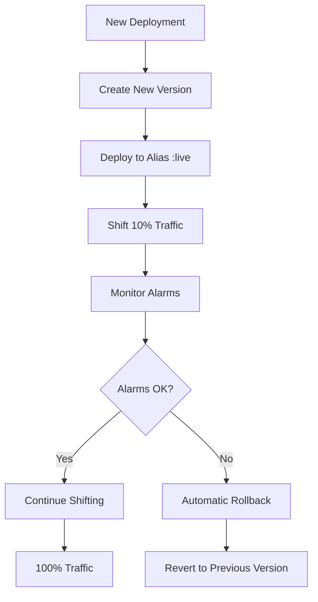

# Part IV:

## 1. Trace logs using X-Ray

AWS X-Ray provides distributed tracing for your serverless applications, allowing you to analyze and debug performance issues across your entire request flow. The atlantis-starter-02 template automatically configures X-Ray tracing for both API Gateway and Lambda functions.

### X-Ray Configuration in the Template

The SAM template enables X-Ray tracing through several key configurations:

**Global X-Ray Settings:**
```yaml
Globals:
  Api:
    TracingEnabled: !If [ IsNotDevelopment, True, False] # X-Ray enabled for TEST and PROD
  Function:
    Tracing: !If [ IsNotDevelopment, "Active", !Ref 'AWS::NoValue'] # X-Ray enabled for TEST and PROD
```

**Cache-Data X-Ray Integration:**
```yaml
Environment:
  Variables:
    CACHE_DATA_AWS_X_RAY_ON: true # Enable X-Ray tracing for Cache-Data operations
```

X-Ray tracing is automatically enabled for TEST and PROD environments but disabled for DEV to reduce costs during local development.

### Reading and Interpreting X-Ray Traces

Once your application is deployed with X-Ray enabled, you can view traces in the AWS X-Ray console:

1. **Access X-Ray Console:**
   - Navigate to AWS X-Ray in the AWS Console
   - Select "Traces" from the left navigation

2. **Understanding the Service Map:**
   - The service map shows the flow of requests through your application
   - Each service appears as a node (API Gateway, Lambda, DynamoDB, S3, External APIs)
   - Connections show the request flow and response times
   - Color coding indicates health: green (normal), yellow (high latency), red (errors)

3. **Analyzing Individual Traces:**
   - Click on a trace to see the detailed timeline
   - Each segment represents a service call with timing information
   - Subsegments show internal operations (cache lookups, external API calls)
   - Error segments are highlighted in red with error details

4. **Key Metrics to Monitor:**
   - **Response Time:** Total time from API Gateway to response
   - **Lambda Duration:** Time spent in your Lambda function
   - **Cache Performance:** DynamoDB and S3 access times via Cache-Data
   - **External API Calls:** Time spent calling remote services
   - **Cold Start Impact:** Initialization time for new Lambda instances

### Custom Trace Annotations

You can add custom annotations and metadata to your traces for better debugging. Here's how to implement custom tracing in your Lambda function:

**Install X-Ray SDK:**
```bash
npm install aws-xray-sdk-core
```

**Add Custom Tracing to Your Code:**
```javascript
// src/index.js
const AWSXRay = require('aws-xray-sdk-core');

// Capture AWS SDK calls
const AWS = AWSXRay.captureAWS(require('aws-sdk'));

exports.handler = async (event, context) => {
    // Add custom annotation for filtering traces
    AWSXRay.putAnnotation('environment', process.env.DEPLOY_ENVIRONMENT);
    AWSXRay.putAnnotation('route', event.resource);
    
    // Add metadata for additional context
    AWSXRay.putMetadata('request', {
        userAgent: event.headers['User-Agent'],
        sourceIP: event.requestContext.identity.sourceIp,
        requestId: event.requestContext.requestId
    });
    
    // Create custom subsegment for business logic
    const segment = AWSXRay.getSegment();
    const subsegment = segment.addNewSubsegment('business-logic');
    
    try {
        // Your business logic here
        const result = await processRequest(event);
        
        // Add success annotation
        subsegment.addAnnotation('success', true);
        subsegment.close();
        
        return result;
    } catch (error) {
        // Add error information to trace
        subsegment.addError(error);
        subsegment.close();
        throw error;
    }
};

async function processRequest(event) {
    // Example: Trace external API calls
    const subsegment = AWSXRay.getSegment().addNewSubsegment('external-api-call');
    
    try {
        subsegment.addAnnotation('api-endpoint', 'https://api.example.com/data');
        
        // Your API call logic here
        const response = await fetch('https://api.example.com/data');
        
        subsegment.addMetadata('response', {
            statusCode: response.status,
            contentLength: response.headers.get('content-length')
        });
        
        subsegment.close();
        return response.json();
    } catch (error) {
        subsegment.addError(error);
        subsegment.close();
        throw error;
    }
}
```

**Tracing Cache-Data Operations:**

The Cache-Data package automatically creates X-Ray subsegments when `CACHE_DATA_AWS_X_RAY_ON` is enabled. You'll see:
- DynamoDB cache lookups
- S3 operations for large cached items
- External API calls made through Cache-Data
- Cache hit/miss information

### Best Practices for X-Ray Tracing

1. **Use Annotations for Filtering:**
   - Add annotations for environment, user type, feature flags
   - Keep annotation values simple (strings, numbers, booleans)
   - Use annotations to create filtered views in the X-Ray console

2. **Add Meaningful Metadata:**
   - Include request details, user context, and business logic state
   - Metadata can be complex objects and is searchable
   - Don't include sensitive information (passwords, tokens)

3. **Create Logical Subsegments:**
   - Group related operations into subsegments
   - Name subsegments clearly (e.g., "database-query", "external-api")
   - Always close subsegments to avoid memory leaks

4. **Monitor Performance Patterns:**
   - Look for consistent slow operations
   - Identify cache effectiveness through Cache-Data traces
   - Monitor cold start frequency and impact

### Troubleshooting Common Issues

**Missing Traces:**
- Verify X-Ray is enabled in your environment (not DEV)
- Check IAM permissions include `AWSXRayDaemonWriteAccess`
- Ensure the X-Ray daemon is running (automatic in Lambda)

**Incomplete Traces:**
- Verify all AWS SDK calls are wrapped with `AWSXRay.captureAWS()`
- Check that subsegments are properly closed
- Ensure HTTP calls use X-Ray compatible libraries

**Performance Impact:**
- X-Ray adds minimal overhead (typically <1ms per trace)
- Sampling rules automatically reduce trace volume in high-traffic scenarios
- Custom sampling rules can be configured for specific needs

## 2. Monitor performance using Lambda Insights and CloudWatch Dashboards

AWS Lambda Insights provides enhanced monitoring capabilities for your Lambda functions, while CloudWatch Dashboards offer customizable visualizations of your application's performance metrics. The atlantis-starter-02 template automatically configures both for comprehensive observability.

### Lambda Insights Setup and Configuration

Lambda Insights is automatically enabled in the SAM template through AWS-managed layers:

**Architecture-Specific Layer Configuration:**
```yaml
Layers:
  # Lambda Insights layers vary by region and architecture
  - !If
    - IsArmArch
    - !FindInMap [LambdaInsightsArm, !Ref 'AWS::Region', ExtArn]
    - !FindInMap [LambdaInsightsX86, !Ref 'AWS::Region', ExtArn]
```

**IAM Permissions:**
```yaml
ManagedPolicyArns:
  - 'arn:aws:iam::aws:policy/CloudWatchLambdaInsightsExecutionRolePolicy'
```

The template includes mappings for multiple regions and both x86_64 and arm64 architectures, ensuring Lambda Insights works regardless of your deployment configuration.

### Key Lambda Insights Metrics

Lambda Insights automatically collects and displays several critical metrics:

1. **Performance Metrics:**
   - **Duration:** Function execution time
   - **Memory Utilization:** Actual memory used vs. allocated
   - **CPU Utilization:** Processor usage during execution
   - **Network Activity:** Bytes sent/received

2. **Operational Metrics:**
   - **Cold Starts:** Frequency and duration of initialization
   - **Concurrent Executions:** Number of simultaneous function instances
   - **Throttles:** Rate limiting events
   - **Errors:** Function failures and their causes

3. **Cost Optimization Insights:**
   - **Over-provisioned Memory:** Identify functions with excess memory allocation
   - **Under-utilized Functions:** Functions that could benefit from optimization
   - **Cost per Invocation:** Financial impact of function performance

### Accessing Lambda Insights

1. **Via Lambda Console:**
   - Navigate to your Lambda function in the AWS Console
   - Click the "Monitoring" tab
   - Select "Lambda Insights" to view enhanced metrics

2. **Via CloudWatch:**
   - Go to CloudWatch → Insights → Lambda Insights
   - View aggregated metrics across all your Lambda functions
   - Use filters to focus on specific functions or time periods

### CloudWatch Dashboard Configuration

The atlantis-starter-02 template includes a comprehensive CloudWatch dashboard that's automatically created for PROD environments:

**Dashboard Creation:**
```yaml
Dashboard:
  Type: AWS::CloudWatch::Dashboard
  Condition: CreateProdResources  # Only created in PROD environment
  Properties:
    DashboardName: !Sub '${Prefix}-${ProjectId}-${StageId}-Dashboard'
```

### Dashboard Widget Categories

The pre-configured dashboard includes several widget categories:

**1. Core Performance Metrics:**
- Lambda invocations and errors over time
- Function duration (average, minimum, maximum)
- Concurrent executions
- API Gateway latency and error rates

**2. Error Monitoring:**
- Lambda function errors
- API Gateway 4XX and 5XX errors
- Alarm status indicators

**3. Memory and Performance Analysis:**
```json
{
  "type": "log",
  "properties": {
    "query": "SOURCE '/aws/lambda/${AppFunction}' | filter @type = \"REPORT\"\n| stats max(@memorySize / 1024 / 1024) as provisonedMemoryMB,\n    min(@maxMemoryUsed / 1024 / 1024) as smallestMemoryRequestMB,\n    avg(@maxMemoryUsed / 1024 / 1024) as avgMemoryUsedMB,\n    max(@maxMemoryUsed / 1024 / 1024) as maxMemoryUsedMB,\n    provisonedMemoryMB - maxMemoryUsedMB as overProvisionedMB"
  }
}
```

**4. Duration Distribution Analysis:**
- Execution time buckets (50ms, 100-250ms, 250-500ms, etc.)
- Performance trend identification
- Outlier detection

**5. Cache Performance Monitoring:**
```json
{
  "type": "log", 
  "properties": {
    "query": "SOURCE '/aws/lambda/${AppFunction}' | fields @timestamp as ts, @message\n| PARSE @message \"[*] * | * | * | *\" as loggingType, id, endpoint, result, execTime\n| FILTER (loggingType = \"CACHE\")\n| stats count(*) as requests, min(execTime) as min_ms, ceil(avg(execTime)) as avg_ms, max(execTime) as max_ms by endpoint, result"
  }
}
```

**6. Cold Start Analysis:**
- Cold start frequency and duration
- Initialization performance tracking
- Impact on overall response times

**7. Request Analysis:**
- Route usage patterns
- Query parameter analysis
- API key usage statistics

### Creating Custom Dashboard Widgets

You can extend the dashboard with additional widgets for specific monitoring needs:

**Custom Metric Widget Example:**
```json
{
  "type": "metric",
  "properties": {
    "metrics": [
      ["AWS/Lambda", "Duration", "FunctionName", "YourFunctionName"],
      ["AWS/ApiGateway", "Latency", "ApiName", "YourApiName"]
    ],
    "period": 300,
    "stat": "Average",
    "region": "us-east-1",
    "title": "Response Time Comparison"
  }
}
```

**Custom Log Query Widget:**
```json
{
  "type": "log",
  "properties": {
    "query": "SOURCE '/aws/lambda/your-function' | fields @timestamp, @message\n| filter @message like /ERROR/\n| sort @timestamp desc\n| limit 20",
    "region": "us-east-1",
    "title": "Recent Errors"
  }
}
```

### Performance Monitoring Best Practices

**1. Memory Optimization:**
- Monitor the "Memory" widget to identify over-provisioned functions
- Look for consistent patterns where `maxMemoryUsedMB` is significantly less than `provisonedMemoryMB`
- Adjust Lambda memory allocation based on actual usage patterns

**2. Duration Analysis:**
- Use the "Durations" widget to identify performance bottlenecks
- Look for requests consistently falling into higher duration buckets
- Investigate functions with high maximum duration values

**3. Cache Effectiveness:**
- Monitor cache hit/miss ratios in the "Cache Utilization" widgets
- Identify endpoints with poor cache performance
- Adjust cache policies based on utilization patterns

**4. Cold Start Management:**
- Track cold start frequency in the "Cold Starts" widget
- Consider provisioned concurrency for functions with frequent cold starts
- Monitor initialization duration for optimization opportunities

**5. Error Pattern Recognition:**
- Use the "Error and Warning Log" widget to identify recurring issues
- Set up alerts for error rate thresholds
- Correlate errors with specific routes or time periods

### Dashboard Access and Sharing

**Accessing Your Dashboard:**
The template automatically provides a direct link in the CloudFormation outputs:
```yaml
CloudWatchDashboard:
  Description: "Cloud Watch Dashboard (for production environments only)"
  Value: !Sub 'https://console.aws.amazon.com/cloudwatch/home?region=${AWS::Region}#dashboards:name=${Dashboard}'
```

**Sharing Dashboards:**
1. **Public URLs:** Generate shareable links for stakeholders
2. **Cross-Account Access:** Share dashboards across AWS accounts
3. **Embedded Widgets:** Integrate specific widgets into external tools

### Cost Considerations

**Dashboard Costs:**
- CloudWatch dashboards cost $3 per dashboard per month
- Custom metrics cost $0.30 per metric per month
- Log queries are charged based on data scanned

**Optimization Strategies:**
- Use the `CreateProdResources` condition to limit dashboards to production
- Implement log retention policies to control storage costs
- Use sampling for high-volume metrics when appropriate

### Troubleshooting Dashboard Issues

**Missing Data:**
- Verify Lambda Insights layer is properly attached
- Check IAM permissions for CloudWatch access
- Ensure log groups exist and have proper retention settings

**Query Performance:**
- Optimize log queries by adding time range filters
- Use specific field filters to reduce data scanning
- Consider using CloudWatch Insights for complex analysis

**Widget Configuration:**
- Validate metric names and dimensions
- Check region consistency across widgets
- Ensure proper JSON formatting for custom widgets

## 3. Create Alarms and Rollbacks

CloudWatch Alarms provide automated monitoring and alerting for your serverless application, while AWS SAM's gradual deployment features enable automatic rollbacks when issues are detected. The atlantis-starter-02 template implements both capabilities to ensure reliable deployments and rapid issue detection.

### CloudWatch Alarm Configuration

The template creates alarms that are automatically integrated with the deployment process:

**Lambda Function Error Alarm:**
```yaml
AppFunctionErrorsAlarm:
  Type: "AWS::CloudWatch::Alarm"
  Condition: CreateAlarms  # Only created in PROD environment
  Properties:
    AlarmDescription: Lambda Function Error > 1
    MetricName: Errors
    Statistic: Sum
    ComparisonOperator: GreaterThanThreshold
    Threshold: 1
    Period: 900  # 15 minutes
    EvaluationPeriods: 1
    TreatMissingData: notBreaching
    Namespace: AWS/Lambda
    Dimensions:
      - Name: FunctionName
        Value: !Ref AppFunction
    AlarmActions:
      - Ref: AppFunctionErrorAlarmNotification
```

**API Gateway Error Alarm:**
```yaml
ApiGatewayErrorsAlarm:
  Type: "AWS::CloudWatch::Alarm"
  Condition: CreateAlarms
  Properties:
    AlarmDescription: API Gateway Error > 1
    MetricName: Errors
    Statistic: Sum
    ComparisonOperator: GreaterThanThreshold
    Threshold: 1
    Period: 900
    EvaluationPeriods: 1
    TreatMissingData: notBreaching
    Namespace: AWS/ApiGateway
    Dimensions:
      - Name: ApiName
        Value: !Ref WebApi
```

### Alarm Notification Setup

Alarms are connected to SNS topics for immediate notification:

**SNS Topic Configuration:**
```yaml
AppFunctionErrorAlarmNotification:
  Type: AWS::SNS::Topic
  Condition: CreateAlarms
  Properties: 
    DisplayName: !Sub 'AWS-Alarm-${Prefix}-${ProjectId}-${StageId}'
    FifoTopic: false
    Subscription:
      - Endpoint: !Ref AlarmNotificationEmail
        Protocol: 'email'
```

**Email Subscription:**
When you deploy the stack, you'll receive an email confirmation for the alarm subscription. You must confirm this subscription to receive alarm notifications.

### Gradual Deployment Configuration

The template implements gradual deployments with automatic rollback capabilities:

**Deployment Preference Settings:**
```yaml
DeploymentPreference:
  Enabled: !If [ IsProduction, True, False]  # Only in PROD
  Type: !If [ IsProduction, !Ref FunctionGradualDeploymentType, "AllAtOnce"]
  Role: !Ref DeployRole
  Alarms:
    Fn::If:
      - CreateAlarms
      - - !Ref AppFunctionErrorsAlarm
      - - !Ref 'AWS::NoValue'
```

**Available Deployment Types:**
- `Canary10Percent5Minutes`: Deploy 10% of traffic, wait 5 minutes, then 100%
- `Canary10Percent10Minutes`: Deploy 10% of traffic, wait 10 minutes, then 100%
- `Linear10PercentEvery1Minute`: Deploy 10% every minute for 10 minutes
- `Linear10PercentEvery3Minutes`: Deploy 10% every 3 minutes for 30 minutes
- `AllAtOnce`: Immediate full deployment (used for DEV/TEST)

### How Gradual Deployment Works

**1. Traffic Shifting Process:**


**2. Lambda Alias Management:**
The template creates both `$LATEST` and `:live` aliases with proper API Gateway permissions:

```yaml
# Permission for $LATEST version (new deployments)
ConfigLambdaPermission:
  Type: "AWS::Lambda::Permission"
  Properties:
    Action: lambda:InvokeFunction
    FunctionName: !Sub "${AppFunction}"  # References $LATEST
    Principal: apigateway.amazonaws.com

# Permission for :live alias (stable version)
ConfigLambdaPermissionLive:
  Type: "AWS::Lambda::Permission"
  Condition: IsProduction
  Properties:
    Action: lambda:InvokeFunction
    FunctionName: !Ref AppFunction.Alias  # References :live alias
    Principal: apigateway.amazonaws.com
```

### Rollback Procedures and Automation

**Automatic Rollback Triggers:**
1. **Alarm State Changes:** Any configured alarm entering ALARM state
2. **CloudWatch Metrics:** Error rates exceeding thresholds
3. **Health Checks:** Failed health check responses

**Manual Rollback Procedures:**

**1. Via AWS Console:**
```bash
# Navigate to Lambda Console
# Select your function
# Go to "Versions" tab
# Find the previous stable version
# Update the :live alias to point to the stable version
```

**2. Via AWS CLI:**
```bash
# List function versions
aws lambda list-versions-by-function --function-name your-function-name

# Update alias to previous version
aws lambda update-alias \
    --function-name your-function-name \
    --name live \
    --function-version 2  # Previous stable version
```

**3. Via SAM CLI:**
```bash
# Redeploy previous version
sam deploy --parameter-overrides \
    AutoPublishCodeSha256="previous-sha" \
    VersionDescription="Rollback to stable version"
```

### Advanced Alarm Configuration

**Custom Alarm Examples:**

**High Latency Alarm:**
```yaml
HighLatencyAlarm:
  Type: AWS::CloudWatch::Alarm
  Properties:
    AlarmDescription: "Lambda duration exceeds 5 seconds"
    MetricName: Duration
    Statistic: Average
    ComparisonOperator: GreaterThanThreshold
    Threshold: 5000  # 5 seconds in milliseconds
    Period: 300
    EvaluationPeriods: 2
    Namespace: AWS/Lambda
    Dimensions:
      - Name: FunctionName
        Value: !Ref AppFunction
```

**Memory Utilization Alarm:**
```yaml
MemoryUtilizationAlarm:
  Type: AWS::CloudWatch::Alarm
  Properties:
    AlarmDescription: "Memory utilization exceeds 90%"
    MetricName: MemoryUtilization
    Statistic: Average
    ComparisonOperator: GreaterThanThreshold
    Threshold: 90
    Period: 300
    EvaluationPeriods: 1
    Namespace: AWS/Lambda
```

**Throttle Alarm:**
```yaml
ThrottleAlarm:
  Type: AWS::CloudWatch::Alarm
  Properties:
    AlarmDescription: "Lambda function throttling detected"
    MetricName: Throttles
    Statistic: Sum
    ComparisonOperator: GreaterThanThreshold
    Threshold: 0
    Period: 300
    EvaluationPeriods: 1
    Namespace: AWS/Lambda
```

### Monitoring Deployment Health

**Key Metrics to Watch During Deployment:**
1. **Error Rate:** Should remain at or near zero
2. **Duration:** Should not increase significantly
3. **Throttles:** Should remain at zero
4. **Memory Usage:** Should stay within expected ranges

**CloudWatch Insights Queries for Deployment Monitoring:**
```sql
-- Monitor error patterns during deployment
SOURCE '/aws/lambda/your-function'
| filter @timestamp > datefloor(@timestamp, 5m)
| filter @type = "REPORT"
| stats count() as invocations, 
        sum(@billedDuration) as totalDuration,
        avg(@billedDuration) as avgDuration,
        max(@maxMemoryUsed) as maxMemory
  by bin(5m)

-- Track cache performance during deployment  
SOURCE '/aws/lambda/your-function'
| filter @message like /CACHE/
| parse @message "[*] * | * | * | *" as logType, id, endpoint, result, execTime
| stats count() as requests,
        avg(execTime) as avgTime
  by result, bin(5m)
```

### Best Practices for Alarms and Rollbacks

**1. Alarm Threshold Setting:**
- Set thresholds based on historical performance data
- Use multiple evaluation periods to avoid false positives
- Consider business impact when setting sensitivity levels

**2. Notification Strategy:**
- Use different notification channels for different severity levels
- Include runbook links in alarm descriptions
- Set up escalation procedures for critical alarms

**3. Testing Rollback Procedures:**
- Regularly test rollback procedures in non-production environments
- Document rollback steps and decision criteria
- Practice manual rollback procedures with your team

**4. Deployment Timing:**
- Schedule deployments during low-traffic periods when possible
- Coordinate with business stakeholders for critical deployments
- Monitor deployments actively during business hours

### Troubleshooting Common Issues

**Deployment Failures:**
- Check CloudFormation events for detailed error messages
- Verify IAM permissions for the deployment role
- Ensure alarm configurations are valid

**False Positive Alarms:**
- Review alarm thresholds and evaluation periods
- Check for external factors affecting performance
- Consider using composite alarms for complex conditions

**Rollback Issues:**
- Verify alias permissions are correctly configured
- Check that previous versions are still available
- Ensure deployment role has necessary Lambda permissions

### Cost Optimization for Alarms

**Alarm Costs:**
- Standard alarms: $0.10 per alarm per month
- High-resolution alarms: $0.30 per alarm per month
- Composite alarms: $0.50 per alarm per month

**Cost Reduction Strategies:**
- Use the `CreateAlarms` condition to limit alarms to production
- Combine related metrics into composite alarms when appropriate
- Regularly review and remove unused alarms

**Resource Cleanup:**
When decommissioning applications, remember to:
1. Delete associated alarms
2. Remove SNS topic subscriptions
3. Clean up unused Lambda versions
4. Remove CloudWatch log groups if no longer needed

## 4. Create unit tests and automate pre-deployment testing

Unit testing is a critical component of maintaining reliable serverless applications. The atlantis-starter-02 template includes a comprehensive testing framework using Mocha and Chai that automatically runs during the build process to catch issues before deployment.

### Understanding the Existing Test Structure

The reference implementation includes a well-organized test suite that demonstrates testing patterns for different application components:

**Test Directory Structure:**
```
src/
├── tests/
│   └── index.mjs          # Main test file with comprehensive examples
├── models/
│   ├── sample-data/       # Input data for testing
│   └── test-data/         # Expected output data for validation
├── .mocharc.json          # Mocha configuration
└── package.json           # Test scripts and dependencies
```

**Test Framework Configuration:**

The project uses Mocha as the test runner with Chai for assertions. The configuration in `.mocharc.json` enables ES modules support:

```json
{
  "node-option": [
    "experimental-modules",
    "experimental-specifier-resolution=node"
  ],
  "require": "node:test",
  "recursive": true
}
```

**Package.json Test Scripts:**
```json
{
  "scripts": {
    "test": "mocha --require=node:test --recursive ./tests/**/*.mjs",
    "tests": "mocha --require=node:test --recursive ./tests/**/*.mjs"
  },
  "devDependencies": {
    "chai": "^6.0.1",
    "mocha": "^11.1.0"
  }
}
```

### Testing Controllers

Controllers handle HTTP request processing and coordinate between services and views. Here's how to test controller functionality:

**Example Controller Test Pattern:**
```javascript
import { expect } from "chai";
import { controller as exampleController } from '../controllers/example.controller.js';

describe('Test controllers/example.controller.js', () => {
    let mockEvent;
    let mockContext;

    beforeEach(() => {
        // Set up mock API Gateway event
        mockEvent = {
            resource: '/example/{code}',
            pathParameters: { code: 'success' },
            queryStringParameters: { players: '4' },
            headers: {
                'User-Agent': 'test-agent',
                'X-API-Key': 'test-key'
            },
            requestContext: {
                requestId: 'test-request-123',
                identity: { sourceIp: '127.0.0.1' }
            }
        };

        // Set up mock Lambda context
        mockContext = {
            requestId: 'test-request-123',
            functionName: 'test-function',
            remainingTimeInMillis: () => 30000
        };
    });

    describe('GET /example/{code}', () => {
        it('should return success response for valid status code', async () => {
            const result = await exampleController.get(mockEvent, mockContext);
            
            expect(result).to.have.property('statusCode', 200);
            expect(result).to.have.property('headers');
            expect(result.headers).to.have.property('Content-Type', 'application/json');
            
            const body = JSON.parse(result.body);
            expect(body).to.have.property('items').that.is.an('array');
            expect(body).to.have.property('count').that.is.a('number');
        });

        it('should return 400 for invalid status code', async () => {
            mockEvent.pathParameters.code = 'invalid_code';
            
            const result = await exampleController.get(mockEvent, mockContext);
            
            expect(result).to.have.property('statusCode', 400);
            const body = JSON.parse(result.body);
            expect(body).to.have.property('error');
        });

        it('should handle missing query parameters gracefully', async () => {
            mockEvent.queryStringParameters = null;
            
            const result = await exampleController.get(mockEvent, mockContext);
            
            expect(result).to.have.property('statusCode', 200);
            // Should use default values when parameters are missing
        });
    });
});
```

### Testing Services

Services contain business logic and coordinate data access. Test services by mocking their dependencies:

**Service Test Example:**
```javascript
import { expect } from "chai";
import { service as exampleService } from '../services/example.service.js';

describe('Test services/example.service.js', () => {
    describe('processExampleData', () => {
        it('should process valid input data correctly', async () => {
            const inputData = {
                code: 'success',
                players: 4,
                apiKey: 'test-key'
            };

            const result = await exampleService.processExampleData(inputData);
            
            expect(result).to.have.property('items').that.is.an('array');
            expect(result).to.have.property('metadata');
            expect(result.metadata).to.have.property('processedAt');
        });

        it('should handle cache miss scenarios', async () => {
            // Test when data is not in cache and must be fetched
            const inputData = {
                code: 'cache_miss_test',
                players: 2,
                apiKey: 'test-key'
            };

            const result = await exampleService.processExampleData(inputData);
            
            expect(result).to.have.property('items');
            expect(result.metadata).to.have.property('cacheHit', false);
        });

        it('should validate input parameters', async () => {
            const invalidData = {
                code: '', // Invalid empty code
                players: 0, // Invalid player count
                apiKey: null
            };

            try {
                await exampleService.processExampleData(invalidData);
                expect.fail('Should have thrown validation error');
            } catch (error) {
                expect(error.message).to.include('validation');
            }
        });
    });
});
```

### Testing Views

Views transform data for presentation. Test views by providing sample input and validating the output format:

**View Test Pattern (from existing tests):**
```javascript
import { expect } from "chai";
import { view as exampleView } from '../views/example.view.js';
import { readFile } from 'fs/promises';
import path from 'path';

describe('Test views/example.view.js', () => {
    let sampleData;
    let expectedData;

    before(async () => {
        // Load test data files
        const sampleFilePath = path.join(__dirname, '..', 'models', 'sample-data', 'example.dao.sample.json');
        const sampleFileContent = await readFile(sampleFilePath, 'utf8');
        sampleData = JSON.parse(sampleFileContent);
        
        const expectedFilePath = path.join(__dirname, '..', 'models', 'test-data', 'example.view.output.json');
        const expectedFileContent = await readFile(expectedFilePath, 'utf8');
        expectedData = JSON.parse(expectedFileContent);
    });

    describe('view function', () => {
        it('should transform example data correctly', () => {
            const result = exampleView(sampleData);

            // Validate structure
            expect(result).to.have.property('items').that.is.an('array');
            expect(result).to.have.property('count', expectedData.count);
            expect(result.items).to.have.lengthOf(expectedData.items.length);

            // Validate transformed data
            for (let i = 0; i < expectedData.items.length; i++) {
                expect(result.items[i]).to.deep.include(expectedData.items[i]);
            }
        });

        it('should handle empty data gracefully', () => {
            const emptyData = { items: [], count: 0 };
            const result = exampleView(emptyData);
            
            expect(result).to.have.property('items').that.is.an('array').with.lengthOf(0);
            expect(result).to.have.property('count', 0);
        });

        it('should preserve required fields', () => {
            const result = exampleView(sampleData);
            
            result.items.forEach(item => {
                expect(item).to.have.property('id');
                expect(item).to.have.property('name');
                expect(item).to.have.property('status');
                // Add other required fields based on your view logic
            });
        });
    });
});
```

### Test Data Management

Effective test data management is crucial for maintainable tests. The atlantis-starter-02 template demonstrates best practices:

**1. Organized Test Data Structure:**
```
models/
├── sample-data/           # Input data for tests
│   ├── example.dao.sample.json
│   ├── weather.api.sample.json
│   └── games.api.sample.json
├── test-data/            # Expected output data
│   ├── example.view.output.json
│   ├── weather.view.output.json
│   └── games.view.output.json
└── static-data/          # Reference data used by application
    ├── statusCodes.json
    └── gameTypes.json
```

**2. Sample Data Creation:**

Create realistic sample data that covers various scenarios:

```javascript
// models/sample-data/weather.api.sample.json
{
  "current": {
    "temperature": 72,
    "humidity": 65,
    "conditions": "partly cloudy",
    "windSpeed": 8,
    "timestamp": "2024-01-15T14:30:00Z"
  },
  "forecast": [
    {
      "date": "2024-01-16",
      "high": 75,
      "low": 58,
      "conditions": "sunny"
    }
  ],
  "location": {
    "city": "Seattle",
    "state": "WA",
    "coordinates": {
      "lat": 47.6062,
      "lon": -122.3321
    }
  }
}
```

**3. Expected Output Data:**

Define expected outputs for validation:

```javascript
// models/test-data/weather.view.output.json
{
  "current": {
    "temp": "72°F",
    "conditions": "Partly Cloudy",
    "humidity": "65%",
    "wind": "8 mph"
  },
  "forecast": [
    {
      "day": "Tuesday",
      "high": "75°F",
      "low": "58°F",
      "summary": "Sunny"
    }
  ],
  "location": "Seattle, WA",
  "lastUpdated": "2024-01-15T14:30:00Z"
}
```

**4. Dynamic Test Data Generation:**

For tests requiring varied data, create helper functions:

```javascript
// tests/helpers/test-data-generator.js
export function generateMockEvent(overrides = {}) {
    return {
        resource: '/example/{code}',
        pathParameters: { code: 'success' },
        queryStringParameters: { players: '4' },
        headers: {
            'User-Agent': 'test-agent',
            'X-API-Key': 'test-key'
        },
        requestContext: {
            requestId: `test-${Date.now()}`,
            identity: { sourceIp: '127.0.0.1' }
        },
        ...overrides
    };
}

export function generateGameData(count = 5) {
    return Array.from({ length: count }, (_, i) => ({
        id: `G-${Math.random().toString(16).substr(2, 8)}`,
        name: `Test Game ${i + 1}`,
        players: Math.floor(Math.random() * 8) + 2,
        status: ['active', 'completed', 'pending'][i % 3]
    }));
}
```

### Testing Validation Functions

The existing test suite demonstrates comprehensive validation testing:

**Validation Test Examples (from existing code):**
```javascript
describe('Test validations from config/validations.js', () => {
    describe('validations.parameters.pathParameters.statusCode', () => {
        it('should validate all entries in statusCodes.json', () => {
            statusCodes.forEach(code => {
                expect(validations.parameters.pathParameters.code(code.code))
                    .to.be.true;
            });
        });

        it('should reject invalid status codes', () => {
            const invalidCodes = ['', '123', 'ABCD', 'A1', '1A', 'AAA'];
            invalidCodes.forEach(code => {
                expect(validations.parameters.pathParameters.code(code))
                    .to.be.false;
            });
        });
    });

    describe('validations.parameters.queryParameters.players', () => {
        it('should validate a valid number of players', () => {
            expect(validations.parameters.queryParameters.players('5'))
                .to.be.true;
        });

        it('should reject invalid player counts', () => {
            const invalidValues = ['0', '11', 'invalid', '', null];
            invalidValues.forEach(value => {
                expect(validations.parameters.queryParameters.players(value))
                    .to.be.false;
            });
        });
    });
});
```

### Testing Utility Functions

Test utility functions thoroughly since they're used throughout the application:

**Utility Test Examples (from existing code):**
```javascript
describe('Test utils', () => {
    describe('utils.hash.takeLast', () => {
        it('should return a string of specified length', () => {
            const input = 'example';
            const result = utils.hash.takeLast(input, 6);
            expect(result).to.have.lengthOf(6);
        });

        it('should be deterministic', () => {
            const input = 'example';
            const result1 = utils.hash.takeLast(input);
            const result2 = utils.hash.takeLast(input);
            expect(result1).to.equal(result2);
        });

        it('should produce different outputs for different inputs', () => {
            const result1 = utils.hash.takeLast('input1');
            const result2 = utils.hash.takeLast('input2');
            expect(result1).to.not.equal(result2);
        });

        it('should contain only valid hexadecimal characters', () => {
            const result = utils.hash.takeLast('example', 20);
            expect(result).to.match(/^[a-f0-9]+$/);
        });
    });
});
```

### Running Tests Locally

**Execute Tests During Development:**
```bash
# Navigate to the source directory
cd application-infrastructure/src

# Install dependencies (including dev dependencies)
npm install --include=dev

# Run all tests
npm test

# Run tests with verbose output
npm test -- --reporter spec

# Run specific test files
npx mocha tests/controllers.test.mjs

# Run tests in watch mode during development
npx mocha tests/**/*.mjs --watch
```

### Test Coverage and Quality Guidelines

**1. Coverage Targets:**
- Aim for 80%+ code coverage on business logic
- 100% coverage on validation functions
- Focus on critical paths and error handling

**2. Test Quality Principles:**
- Each test should verify one specific behavior
- Use descriptive test names that explain the expected behavior
- Include both positive and negative test cases
- Test edge cases and boundary conditions

**3. Test Organization:**
- Group related tests using `describe` blocks
- Use `beforeEach` and `afterEach` for test setup and cleanup
- Keep tests independent - each test should be able to run in isolation

**4. Assertion Best Practices:**
```javascript
// Good: Specific assertions with clear error messages
expect(result.statusCode, 'HTTP status should be 200').to.equal(200);
expect(result.body, 'Response body should be valid JSON').to.be.a('string');

// Good: Deep equality checks for objects
expect(result.data).to.deep.equal(expectedData);

// Good: Property existence and type checking
expect(result).to.have.property('items').that.is.an('array');
```

### Debugging Test Failures

**Common Test Debugging Techniques:**

**1. Add Debug Output:**
```javascript
it('should process data correctly', () => {
    const result = processData(input);
    console.log('Debug - Result:', JSON.stringify(result, null, 2));
    expect(result).to.have.property('success', true);
});
```

**2. Use Mocha's Built-in Debugging:**
```bash
# Run tests with Node.js debugging
node --inspect-brk ./node_modules/.bin/mocha tests/**/*.mjs

# Run specific test with timeout disabled for debugging
npx mocha tests/example.test.mjs --timeout 0 --grep "specific test name"
```

**3. Isolate Failing Tests:**
```javascript
// Use .only to run just one test
it.only('should handle edge case', () => {
    // Test implementation
});

// Use .skip to temporarily disable tests
it.skip('should handle complex scenario', () => {
    // Test implementation
});
```

This comprehensive unit testing approach ensures that your serverless application components are thoroughly validated before deployment, catching issues early in the development cycle and maintaining code quality as your application evolves.

## 5. Automated Testing Strategies

Automated testing in serverless applications involves multiple layers: pre-deployment testing during the build process, and post-deployment testing to validate the live environment. The atlantis-starter-02 template implements comprehensive automated testing strategies that ensure code quality and system reliability.

### Pre-Deployment Testing in BuildSpec

The buildspec.yml file orchestrates automated testing as part of the CI/CD pipeline, ensuring that no code reaches production without passing comprehensive tests.

**BuildSpec Testing Flow:**
```yaml
phases:
  pre_build:
    commands:
      # Install dependencies including dev dependencies for testing
      - cd application-infrastructure/src
      - npm install --include=dev
      
      # Run comprehensive test suite
      - npm test
      
      # Remove dev dependencies for production deployment
      - npm prune --omit=dev
      
      # Security audit - fail build if high vulnerabilities found
      - npm audit fix --force
      - npm audit --audit-level=high
```

**Why This Approach Works:**

1. **Early Failure Detection:** Tests run before any deployment artifacts are created
2. **Clean Production Environment:** Dev dependencies are removed after testing
3. **Security Validation:** Automated vulnerability scanning prevents insecure deployments
4. **Build Artifact Integrity:** Only tested, clean code proceeds to deployment

### Comprehensive Pre-Deployment Test Strategy

**1. Multi-Layer Test Execution:**

The automated testing strategy should include multiple test types executed in sequence:

```bash
# Example enhanced test script in package.json
{
  "scripts": {
    "test": "npm run test:lint && npm run test:unit && npm run test:integration",
    "test:lint": "eslint src/**/*.js --fix",
    "test:unit": "mocha --recursive ./tests/unit/**/*.mjs",
    "test:integration": "mocha --recursive ./tests/integration/**/*.mjs",
    "test:security": "npm audit --audit-level=high",
    "test:coverage": "nyc npm run test:unit"
  }
}
```

**2. Enhanced BuildSpec with Comprehensive Testing:**

```yaml
pre_build:
  commands:
    - cd application-infrastructure/src
    - npm install --include=dev
    
    # Code quality checks
    - echo "Running linting checks..."
    - npm run test:lint
    
    # Unit tests with coverage
    - echo "Running unit tests with coverage..."
    - npm run test:coverage
    
    # Integration tests
    - echo "Running integration tests..."
    - npm run test:integration
    
    # Security audit
    - echo "Running security audit..."
    - npm run test:security
    
    # Template validation
    - cd ..
    - echo "Validating CloudFormation template..."
    - aws cloudformation validate-template --template-body file://template.yml
    
    # Clean up for production
    - cd src
    - npm prune --omit=dev
```

### Integration Testing Examples

Integration tests validate that different components work together correctly:

**API Integration Test:**
```javascript
// tests/integration/api.integration.test.mjs
import { expect } from "chai";
import { handler } from '../../index.js';

describe('API Integration Tests', () => {
    describe('Example API Endpoint', () => {
        it('should handle complete request flow', async () => {
            const event = {
                resource: '/example/{code}',
                httpMethod: 'GET',
                pathParameters: { code: 'success' },
                queryStringParameters: { players: '4' },
                headers: {
                    'Content-Type': 'application/json',
                    'X-API-Key': 'test-key'
                },
                requestContext: {
                    requestId: 'test-integration-123',
                    identity: { sourceIp: '127.0.0.1' }
                }
            };

            const context = {
                requestId: 'test-integration-123',
                functionName: 'test-function',
                remainingTimeInMillis: () => 30000
            };

            const result = await handler(event, context);
            
            // Validate complete response structure
            expect(result).to.have.property('statusCode', 200);
            expect(result).to.have.property('headers');
            expect(result.headers).to.include({
                'Content-Type': 'application/json',
                'Access-Control-Allow-Origin': '*'
            });
            
            const body = JSON.parse(result.body);
            expect(body).to.have.property('items').that.is.an('array');
            expect(body).to.have.property('count').that.is.a('number');
            expect(body).to.have.property('metadata');
        });

        it('should handle error scenarios gracefully', async () => {
            const event = {
                resource: '/example/{code}',
                httpMethod: 'GET',
                pathParameters: { code: 'invalid_code' },
                queryStringParameters: null,
                headers: {},
                requestContext: {
                    requestId: 'test-error-123',
                    identity: { sourceIp: '127.0.0.1' }
                }
            };

            const result = await handler(event, {});
            
            expect(result).to.have.property('statusCode', 400);
            const body = JSON.parse(result.body);
            expect(body).to.have.property('error');
            expect(body).to.have.property('message');
        });
    });

    describe('Cache Integration', () => {
        it('should handle cache operations correctly', async () => {
            // Test cache miss scenario
            const event1 = createTestEvent('cache_test_unique_key');
            const result1 = await handler(event1, {});
            
            expect(result1.statusCode).to.equal(200);
            const body1 = JSON.parse(result1.body);
            expect(body1.metadata).to.have.property('cacheHit', false);
            
            // Test cache hit scenario (same key)
            const event2 = createTestEvent('cache_test_unique_key');
            const result2 = await handler(event2, {});
            
            expect(result2.statusCode).to.equal(200);
            const body2 = JSON.parse(result2.body);
            expect(body2.metadata).to.have.property('cacheHit', true);
        });
    });
});

function createTestEvent(code) {
    return {
        resource: '/example/{code}',
        httpMethod: 'GET',
        pathParameters: { code },
        queryStringParameters: { players: '4' },
        headers: { 'X-API-Key': 'test-key' },
        requestContext: {
            requestId: `test-${Date.now()}`,
            identity: { sourceIp: '127.0.0.1' }
        }
    };
}
```

**Configuration Integration Test:**
```javascript
// tests/integration/config.integration.test.mjs
import { expect } from "chai";
import Config from '../../config/index.js';

describe('Configuration Integration Tests', () => {
    describe('Config Initialization', () => {
        it('should initialize all required configuration', async () => {
            // Test that Config.init() sets up all necessary components
            await Config.init();
            
            expect(Config.Cache).to.not.be.undefined;
            expect(Config.DebugAndLog).to.not.be.undefined;
            expect(Config.Timer).to.not.be.undefined;
            expect(Config.settings).to.not.be.undefined;
        });

        it('should handle missing environment variables gracefully', async () => {
            // Temporarily remove environment variable
            const originalValue = process.env.CACHE_DATA_SECURE_DATA_KEY;
            delete process.env.CACHE_DATA_SECURE_DATA_KEY;
            
            try {
                await Config.init();
                // Should still initialize with defaults or throw meaningful error
                expect(Config.Cache).to.not.be.undefined;
            } catch (error) {
                expect(error.message).to.include('configuration');
            } finally {
                // Restore environment variable
                if (originalValue) {
                    process.env.CACHE_DATA_SECURE_DATA_KEY = originalValue;
                }
            }
        });
    });
});
```

### Post-Deployment Testing Approaches

Post-deployment testing validates that the deployed application works correctly in the live environment:

**1. Health Check Testing:**

Create automated health checks that run after deployment:

```javascript
// tests/post-deployment/health-check.test.mjs
import { expect } from "chai";
import https from 'https';
import { URL } from 'url';

describe('Post-Deployment Health Checks', () => {
    const baseUrl = process.env.API_ENDPOINT || 'https://your-api-gateway-url';
    const apiKey = process.env.API_KEY || 'your-test-api-key';

    describe('API Endpoint Health', () => {
        it('should respond to health check endpoint', async () => {
            const response = await makeRequest(`${baseUrl}/example/success`, {
                'X-API-Key': apiKey
            });
            
            expect(response.statusCode).to.equal(200);
            expect(response.body).to.have.property('items');
        });

        it('should handle CORS correctly', async () => {
            const response = await makeRequest(`${baseUrl}/example/success`, {
                'X-API-Key': apiKey,
                'Origin': 'https://example.com'
            });
            
            expect(response.headers).to.have.property('access-control-allow-origin');
        });

        it('should validate API key authentication', async () => {
            const response = await makeRequest(`${baseUrl}/example/success`, {
                'X-API-Key': 'invalid-key'
            });
            
            expect(response.statusCode).to.equal(403);
        });
    });

    describe('Performance Validation', () => {
        it('should respond within acceptable time limits', async () => {
            const startTime = Date.now();
            
            const response = await makeRequest(`${baseUrl}/example/success`, {
                'X-API-Key': apiKey
            });
            
            const responseTime = Date.now() - startTime;
            
            expect(response.statusCode).to.equal(200);
            expect(responseTime).to.be.below(5000); // 5 second timeout
        });

        it('should handle concurrent requests', async () => {
            const requests = Array.from({ length: 10 }, () => 
                makeRequest(`${baseUrl}/example/success`, {
                    'X-API-Key': apiKey
                })
            );
            
            const responses = await Promise.all(requests);
            
            responses.forEach(response => {
                expect(response.statusCode).to.equal(200);
            });
        });
    });
});

async function makeRequest(url, headers = {}) {
    return new Promise((resolve, reject) => {
        const urlObj = new URL(url);
        const options = {
            hostname: urlObj.hostname,
            port: urlObj.port || 443,
            path: urlObj.pathname + urlObj.search,
            method: 'GET',
            headers: {
                'Content-Type': 'application/json',
                ...headers
            }
        };

        const req = https.request(options, (res) => {
            let body = '';
            res.on('data', (chunk) => body += chunk);
            res.on('end', () => {
                try {
                    resolve({
                        statusCode: res.statusCode,
                        headers: res.headers,
                        body: JSON.parse(body)
                    });
                } catch (error) {
                    resolve({
                        statusCode: res.statusCode,
                        headers: res.headers,
                        body: body
                    });
                }
            });
        });

        req.on('error', reject);
        req.setTimeout(10000, () => {
            req.destroy();
            reject(new Error('Request timeout'));
        });
        req.end();
    });
}
```

**2. Data Validation Testing:**

Validate that the deployed application processes data correctly:

```javascript
// tests/post-deployment/data-validation.test.mjs
import { expect } from "chai";

describe('Post-Deployment Data Validation', () => {
    describe('Cache Functionality', () => {
        it('should demonstrate cache hit/miss behavior', async () => {
            const uniqueCode = `test_${Date.now()}`;
            
            // First request should be cache miss
            const response1 = await makeApiRequest('/example/' + uniqueCode);
            expect(response1.body.metadata.cacheHit).to.be.false;
            
            // Second request should be cache hit
            const response2 = await makeApiRequest('/example/' + uniqueCode);
            expect(response2.body.metadata.cacheHit).to.be.true;
            
            // Data should be identical
            expect(response1.body.items).to.deep.equal(response2.body.items);
        });

        it('should handle different query parameters correctly', async () => {
            const responses = await Promise.all([
                makeApiRequest('/example/success?players=2'),
                makeApiRequest('/example/success?players=4'),
                makeApiRequest('/example/success?players=8')
            ]);
            
            responses.forEach(response => {
                expect(response.statusCode).to.equal(200);
                expect(response.body.items).to.be.an('array');
            });
            
            // Different parameters should potentially return different data
            const playerCounts = responses.map(r => r.body.items.length);
            // Validate that the service respects player count parameters
        });
    });

    describe('Error Handling', () => {
        it('should handle invalid status codes gracefully', async () => {
            const response = await makeApiRequest('/example/invalid_status_code');
            
            expect(response.statusCode).to.equal(400);
            expect(response.body).to.have.property('error');
            expect(response.body.error).to.include('validation');
        });

        it('should handle missing API key', async () => {
            const response = await makeApiRequest('/example/success', {}, false);
            
            expect(response.statusCode).to.equal(403);
        });
    });
});
```

### Automated Post-Deployment Testing in BuildSpec

Integrate post-deployment testing into your CI/CD pipeline:

**Enhanced BuildSpec with Post-Deployment Testing:**
```yaml
phases:
  post_build:
    commands:
      # Deploy the application first
      - aws cloudformation deploy --template-file template-export.yml --stack-name $STACK_NAME --parameter-overrides file://template-configuration.json --capabilities CAPABILITY_IAM
      
      # Wait for deployment to complete and get outputs
      - |
        API_ENDPOINT=$(aws cloudformation describe-stacks --stack-name $STACK_NAME --query 'Stacks[0].Outputs[?OutputKey==`WebApiEndpoint`].OutputValue' --output text)
        echo "API Endpoint: $API_ENDPOINT"
        
      # Run post-deployment tests
      - cd application-infrastructure/src
      - npm install --include=dev
      - API_ENDPOINT=$API_ENDPOINT API_KEY=$API_KEY npm run test:post-deployment
      
      # Clean up test dependencies
      - npm prune --omit=dev

    finally:
      # Always run cleanup, even if tests fail
      - echo "Post-deployment testing completed"
```

**Package.json Post-Deployment Test Script:**
```json
{
  "scripts": {
    "test:post-deployment": "mocha --recursive ./tests/post-deployment/**/*.mjs --timeout 30000"
  }
}
```

### Continuous Integration Best Practices

**1. Test Environment Isolation:**

Use separate test environments to avoid conflicts:

```yaml
# In template-configuration.json
{
  "Parameters": {
    "DeployEnvironment": "TEST",
    "ProjectId": "tutorial02-test",
    "StageId": "ci-test"
  }
}
```

**2. Parallel Test Execution:**

For faster feedback, run independent tests in parallel:

```bash
# Run unit and integration tests in parallel
npm run test:unit & npm run test:integration & wait

# Run post-deployment tests after deployment
npm run test:post-deployment
```

**3. Test Result Reporting:**

Configure test reporting for CI/CD visibility:

```json
{
  "scripts": {
    "test:ci": "mocha --recursive ./tests/**/*.mjs --reporter json > test-results.json"
  }
}
```

### Monitoring Test Results

**1. CloudWatch Integration:**

Send test results to CloudWatch for monitoring:

```javascript
// tests/helpers/cloudwatch-reporter.js
import { CloudWatchClient, PutMetricDataCommand } from "@aws-sdk/client-cloudwatch";

export async function reportTestResults(testResults) {
    const cloudwatch = new CloudWatchClient({ region: process.env.AWS_REGION });
    
    const params = {
        Namespace: 'Tutorial02/Testing',
        MetricData: [
            {
                MetricName: 'TestsPassed',
                Value: testResults.passed,
                Unit: 'Count',
                Timestamp: new Date()
            },
            {
                MetricName: 'TestsFailed',
                Value: testResults.failed,
                Unit: 'Count',
                Timestamp: new Date()
            }
        ]
    };
    
    await cloudwatch.send(new PutMetricDataCommand(params));
}
```

**2. Alarm Configuration for Test Failures:**

Create CloudWatch alarms for test failures:

```yaml
TestFailureAlarm:
  Type: AWS::CloudWatch::Alarm
  Properties:
    AlarmDescription: "Post-deployment tests are failing"
    MetricName: TestsFailed
    Namespace: Tutorial02/Testing
    Statistic: Sum
    ComparisonOperator: GreaterThanThreshold
    Threshold: 0
    Period: 300
    EvaluationPeriods: 1
```

### Troubleshooting Automated Testing

**Common Issues and Solutions:**

**1. Test Timeouts:**
```javascript
// Increase timeout for integration tests
describe('Slow Integration Tests', () => {
    before(function() {
        this.timeout(30000); // 30 second timeout
    });
    
    it('should handle slow operations', async function() {
        this.timeout(60000); // 60 second timeout for this specific test
        // Test implementation
    });
});
```

**2. Environment Variable Issues:**
```javascript
// Validate required environment variables
before(() => {
    const requiredVars = ['API_ENDPOINT', 'API_KEY', 'AWS_REGION'];
    const missing = requiredVars.filter(varName => !process.env[varName]);
    
    if (missing.length > 0) {
        throw new Error(`Missing required environment variables: ${missing.join(', ')}`);
    }
});
```

**3. Network and Connectivity Issues:**
```javascript
// Add retry logic for network-dependent tests
async function retryRequest(requestFn, maxRetries = 3) {
    for (let i = 0; i < maxRetries; i++) {
        try {
            return await requestFn();
        } catch (error) {
            if (i === maxRetries - 1) throw error;
            await new Promise(resolve => setTimeout(resolve, 1000 * (i + 1)));
        }
    }
}
```

This comprehensive automated testing strategy ensures that your serverless application is thoroughly validated at every stage of the deployment pipeline, from code commit to production deployment, maintaining high quality and reliability standards.

## 6. Automate API Documentation Generation and Deployment

API documentation is crucial for serverless applications, and the atlantis-starter-02 template provides a foundation for automated API documentation using OpenAPI specifications. This section covers how to generate, validate, and deploy comprehensive API documentation automatically.

### OpenAPI Specification Integration

The template uses OpenAPI 3.0 specifications that are automatically integrated into API Gateway during deployment:

**Template Integration:**
```yaml
# In template.yml
Globals:
  Api:
    OpenApiVersion: 3.0.0  # Prevents extra stage creation in API Gateway
    PropagateTags: True
    TracingEnabled: !If [ IsNotDevelopment, True, False]

# API Gateway Resource
WebApi:
  Type: AWS::Serverless::Api
  Properties:
    DefinitionBody:
      "Fn::Transform":
        Name: "AWS::Include"
        Parameters:
          Location: ./template-openapi-spec.yml  # External OpenAPI specification
```

**Current OpenAPI Structure:**
```yaml
# template-openapi-spec.yml
openapi: '3.0.0'
info:
  title: "Web Service API"
  description: "An API"
  version: "0.1"
  contact:
    name: "Your Name"
    url: "https://example.com"
    email: "contact@example.com"

paths:
  /api/example/:
    get:
      description: "GET API Example"
      responses:
        $ref: '#/components/schemas/DataResponses'
      x-amazon-apigateway-integration:
        httpMethod: post
        type: aws_proxy
        uri:
          Fn::Sub: arn:aws:apigateway:${AWS::Region}:lambda:path/2015-03-31/functions/${AppFunction.Arn}/invocations
```

### Comprehensive OpenAPI Specification

Expand the OpenAPI specification to include detailed documentation for all endpoints:

**Enhanced OpenAPI Specification:**
```yaml
# template-openapi-spec.yml
openapi: '3.0.0'
info:
  title: "Tutorial 02 - Advanced API Gateway Lambda Cache Data API"
  description: |
    A comprehensive serverless API demonstrating advanced patterns including:
    - Caching with DynamoDB and S3
    - Multiple data sources integration
    - Error handling and validation
    - Performance monitoring
  version: "1.0.0"
  contact:
    name: "API Support"
    url: "https://github.com/your-org/atlantis-starter-02"
    email: "api-support@example.com"
  license:
    name: "MIT"
    url: "https://opensource.org/licenses/MIT"

servers:
  - url: https://your-api-gateway-url.execute-api.region.amazonaws.com/Prod
    description: Production server
  - url: https://your-api-gateway-url.execute-api.region.amazonaws.com/Test  
    description: Test server

# =============================================================================

paths:

  /api/example/{code}:
    get:
      summary: "Get example data by status code"
      description: |
        Retrieves example game data based on the provided status code.
        This endpoint demonstrates caching, data transformation, and error handling.
      operationId: getExampleByCode
      tags:
        - Examples
      parameters:
        - $ref: '#/components/parameters/StatusCode'
        - $ref: '#/components/parameters/Players'
        - $ref: '#/components/parameters/ApiKey'
      responses:
        '200':
          description: "Successfully retrieved example data"
          content:
            application/json:
              schema:
                $ref: '#/components/schemas/ExampleResponse'
              examples:
                success:
                  summary: "Successful response example"
                  value:
                    items:
                      - id: "G-92d3ace7"
                        name: "Example Game 1"
                        players: 4
                        status: "active"
                    count: 1
                    metadata:
                      cacheHit: true
                      processedAt: "2024-01-15T14:30:00Z"
        '400':
          $ref: '#/components/responses/BadRequest'
        '403':
          $ref: '#/components/responses/Forbidden'
        '500':
          $ref: '#/components/responses/InternalServerError'
      x-amazon-apigateway-integration:
        httpMethod: post
        type: aws_proxy
        uri:
          Fn::Sub: arn:aws:apigateway:${AWS::Region}:lambda:path/2015-03-31/functions/${AppFunction.Arn}/invocations

  /api/weather/{location}:
    get:
      summary: "Get weather data for location"
      description: |
        Retrieves current weather and forecast data for the specified location.
        Demonstrates external API integration with caching.
      operationId: getWeatherByLocation
      tags:
        - Weather
      parameters:
        - name: location
          in: path
          required: true
          description: "Location name (city, state or city, country)"
          schema:
            type: string
            example: "Seattle, WA"
        - $ref: '#/components/parameters/ApiKey'
      responses:
        '200':
          description: "Successfully retrieved weather data"
          content:
            application/json:
              schema:
                $ref: '#/components/schemas/WeatherResponse'
        '400':
          $ref: '#/components/responses/BadRequest'
        '403':
          $ref: '#/components/responses/Forbidden'
        '404':
          description: "Location not found"
          content:
            application/json:
              schema:
                $ref: '#/components/schemas/ErrorResponse'
      x-amazon-apigateway-integration:
        httpMethod: post
        type: aws_proxy
        uri:
          Fn::Sub: arn:aws:apigateway:${AWS::Region}:lambda:path/2015-03-31/functions/${AppFunction.Arn}/invocations

  /api/8ball:
    get:
      summary: "Get Magic 8-Ball response"
      description: |
        Returns a random Magic 8-Ball response.
        Demonstrates simple service without caching.
      operationId: get8BallResponse
      tags:
        - Fun
      parameters:
        - name: question
          in: query
          required: false
          description: "The question to ask the Magic 8-Ball"
          schema:
            type: string
            example: "Will this tutorial be helpful?"
        - $ref: '#/components/parameters/ApiKey'
      responses:
        '200':
          description: "Magic 8-Ball response"
          content:
            application/json:
              schema:
                $ref: '#/components/schemas/EightBallResponse'
      x-amazon-apigateway-integration:
        httpMethod: post
        type: aws_proxy
        uri:
          Fn::Sub: arn:aws:apigateway:${AWS::Region}:lambda:path/2015-03-31/functions/${AppFunction.Arn}/invocations

  /api/tokens:
    post:
      summary: "Generate game token"
      description: |
        Generates a new game token and stores it in DynamoDB.
        Demonstrates database integration and token management.
      operationId: generateGameToken
      tags:
        - Tokens
      parameters:
        - $ref: '#/components/parameters/ApiKey'
      requestBody:
        required: true
        content:
          application/json:
            schema:
              $ref: '#/components/schemas/TokenRequest'
      responses:
        '201':
          description: "Token created successfully"
          content:
            application/json:
              schema:
                $ref: '#/components/schemas/TokenResponse'
        '400':
          $ref: '#/components/responses/BadRequest'
        '403':
          $ref: '#/components/responses/Forbidden'
      x-amazon-apigateway-integration:
        httpMethod: post
        type: aws_proxy
        uri:
          Fn::Sub: arn:aws:apigateway:${AWS::Region}:lambda:path/2015-03-31/functions/${AppFunction.Arn}/invocations

# =============================================================================

components:

  parameters:

    StatusCode:
      name: code
      in: path
      required: true
      description: "Status code for filtering examples"
      schema:
        type: string
        pattern: '^[a-z]+$'
        example: "success"
      examples:
        success:
          value: "success"
          summary: "Success status"
        error:
          value: "error"
          summary: "Error status"
        pending:
          value: "pending"
          summary: "Pending status"

    Players:
      name: players
      in: query
      required: false
      description: "Number of players (1-10)"
      schema:
        type: integer
        minimum: 1
        maximum: 10
        default: 4
        example: 4

    ApiKey:
      name: X-API-Key
      in: header
      required: true
      description: "API key for authentication"
      schema:
        type: string
        example: "your-api-key-here"

  # ---------------------------------------------------------------------------

  schemas:

    # Response Objects

    ExampleResponse:
      type: object
      title: "Example API Response"
      description: "Response containing example game data"
      required:
        - items
        - count
        - metadata
      properties:
        items:
          type: array
          items:
            $ref: '#/components/schemas/GameItem'
        count:
          type: integer
          description: "Number of items returned"
          example: 5
        metadata:
          $ref: '#/components/schemas/ResponseMetadata'

    WeatherResponse:
      type: object
      title: "Weather API Response"
      description: "Current weather and forecast data"
      required:
        - current
        - location
      properties:
        current:
          $ref: '#/components/schemas/CurrentWeather'
        forecast:
          type: array
          items:
            $ref: '#/components/schemas/ForecastDay'
        location:
          type: string
          example: "Seattle, WA"
        metadata:
          $ref: '#/components/schemas/ResponseMetadata'

    EightBallResponse:
      type: object
      title: "Magic 8-Ball Response"
      description: "Magic 8-Ball answer"
      required:
        - answer
        - question
      properties:
        question:
          type: string
          example: "Will this tutorial be helpful?"
        answer:
          type: string
          example: "It is certain"
        metadata:
          $ref: '#/components/schemas/ResponseMetadata'

    TokenResponse:
      type: object
      title: "Token Generation Response"
      description: "Generated game token information"
      required:
        - token
        - expiresAt
      properties:
        token:
          type: string
          example: "GT-a1b2c3d4e5f6"
        expiresAt:
          type: string
          format: date-time
          example: "2024-01-15T15:30:00Z"
        gameId:
          type: string
          example: "G-92d3ace7"
        metadata:
          $ref: '#/components/schemas/ResponseMetadata'

    # Request Objects

    TokenRequest:
      type: object
      title: "Token Generation Request"
      description: "Request to generate a new game token"
      required:
        - gameType
        - players
      properties:
        gameType:
          type: string
          enum: ["standard", "tournament", "practice"]
          example: "standard"
        players:
          type: integer
          minimum: 1
          maximum: 10
          example: 4
        duration:
          type: integer
          description: "Token validity duration in minutes"
          minimum: 5
          maximum: 1440
          default: 60
          example: 60

    # Data Objects

    GameItem:
      type: object
      title: "Game Item"
      description: "Individual game data item"
      required:
        - id
        - name
        - status
      properties:
        id:
          type: string
          pattern: '^G-[a-f0-9]{8}$'
          example: "G-92d3ace7"
        name:
          type: string
          example: "Example Game 1"
        players:
          type: integer
          minimum: 1
          maximum: 10
          example: 4
        status:
          type: string
          enum: ["active", "completed", "pending", "cancelled"]
          example: "active"
        createdAt:
          type: string
          format: date-time
          example: "2024-01-15T14:00:00Z"

    CurrentWeather:
      type: object
      title: "Current Weather"
      description: "Current weather conditions"
      required:
        - temperature
        - conditions
      properties:
        temperature:
          type: number
          example: 72.5
        conditions:
          type: string
          example: "Partly Cloudy"
        humidity:
          type: integer
          minimum: 0
          maximum: 100
          example: 65
        windSpeed:
          type: number
          example: 8.2

    ForecastDay:
      type: object
      title: "Forecast Day"
      description: "Daily weather forecast"
      required:
        - date
        - high
        - low
        - conditions
      properties:
        date:
          type: string
          format: date
          example: "2024-01-16"
        high:
          type: number
          example: 75.0
        low:
          type: number
          example: 58.0
        conditions:
          type: string
          example: "Sunny"

    ResponseMetadata:
      type: object
      title: "Response Metadata"
      description: "Metadata about the API response"
      properties:
        cacheHit:
          type: boolean
          description: "Whether the response was served from cache"
          example: true
        processedAt:
          type: string
          format: date-time
          description: "When the response was processed"
          example: "2024-01-15T14:30:00Z"
        requestId:
          type: string
          description: "Unique request identifier"
          example: "req-123456789"
        version:
          type: string
          description: "API version"
          example: "1.0.0"

    ErrorResponse:
      type: object
      title: "Error Response"
      description: "Standard error response format"
      required:
        - error
        - message
      properties:
        error:
          type: string
          example: "ValidationError"
        message:
          type: string
          example: "Invalid status code provided"
        details:
          type: object
          description: "Additional error details"
        requestId:
          type: string
          example: "req-123456789"

  # ---------------------------------------------------------------------------

  responses:

    BadRequest:
      description: "Bad Request - Invalid input parameters"
      content:
        application/json:
          schema:
            $ref: '#/components/schemas/ErrorResponse'
          examples:
            validation_error:
              summary: "Validation error example"
              value:
                error: "ValidationError"
                message: "Invalid status code provided"
                details:
                  field: "code"
                  value: "invalid_code"
                  expected: "lowercase letters only"

    Forbidden:
      description: "Forbidden - Invalid or missing API key"
      content:
        application/json:
          schema:
            $ref: '#/components/schemas/ErrorResponse'
          examples:
            missing_api_key:
              summary: "Missing API key"
              value:
                error: "AuthenticationError"
                message: "API key is required"
            invalid_api_key:
              summary: "Invalid API key"
              value:
                error: "AuthenticationError"
                message: "Invalid API key provided"

    InternalServerError:
      description: "Internal Server Error"
      content:
        application/json:
          schema:
            $ref: '#/components/schemas/ErrorResponse'
          examples:
            server_error:
              summary: "Server error example"
              value:
                error: "InternalServerError"
                message: "An unexpected error occurred"
                requestId: "req-123456789"

  # ---------------------------------------------------------------------------

  securitySchemes:
    ApiKeyAuth:
      type: apiKey
      in: header
      name: X-API-Key
      description: "API key for authentication"

security:
  - ApiKeyAuth: []

# =============================================================================

tags:
  - name: Examples
    description: "Example endpoints demonstrating various patterns"
  - name: Weather
    description: "Weather data endpoints"
  - name: Fun
    description: "Fun and utility endpoints"
  - name: Tokens
    description: "Token management endpoints"
```

### Automated Documentation Generation

Create scripts to automatically generate and validate API documentation:

**1. Documentation Generation Script:**
```javascript
// scripts/generate-docs.js
import fs from 'fs/promises';
import path from 'path';
import yaml from 'js-yaml';

async function generateApiDocumentation() {
    try {
        // Read OpenAPI specification
        const specPath = path.join(process.cwd(), 'template-openapi-spec.yml');
        const specContent = await fs.readFile(specPath, 'utf8');
        const spec = yaml.load(specContent);
        
        // Generate markdown documentation
        const markdown = generateMarkdownFromSpec(spec);
        
        // Write documentation file
        const docsPath = path.join(process.cwd(), 'docs', 'api-reference.md');
        await fs.mkdir(path.dirname(docsPath), { recursive: true });
        await fs.writeFile(docsPath, markdown);
        
        console.log('API documentation generated successfully');
        
        // Generate Postman collection
        const postmanCollection = generatePostmanCollection(spec);
        const collectionPath = path.join(process.cwd(), 'docs', 'api-collection.json');
        await fs.writeFile(collectionPath, JSON.stringify(postmanCollection, null, 2));
        
        console.log('Postman collection generated successfully');
        
    } catch (error) {
        console.error('Error generating documentation:', error);
        process.exit(1);
    }
}

function generateMarkdownFromSpec(spec) {
    let markdown = `# ${spec.info.title}\n\n`;
    markdown += `${spec.info.description}\n\n`;
    markdown += `**Version:** ${spec.info.version}\n\n`;
    
    if (spec.info.contact) {
        markdown += `**Contact:** [${spec.info.contact.name}](${spec.info.contact.url})\n\n`;
    }
    
    // Generate table of contents
    markdown += `## Table of Contents\n\n`;
    for (const [path, methods] of Object.entries(spec.paths)) {
        for (const [method, operation] of Object.entries(methods)) {
            if (operation.operationId) {
                markdown += `- [${method.toUpperCase()} ${path}](#${operation.operationId})\n`;
            }
        }
    }
    markdown += `\n`;
    
    // Generate endpoint documentation
    markdown += `## Endpoints\n\n`;
    for (const [path, methods] of Object.entries(spec.paths)) {
        for (const [method, operation] of Object.entries(methods)) {
            markdown += generateEndpointDocumentation(path, method, operation, spec);
        }
    }
    
    return markdown;
}

function generateEndpointDocumentation(path, method, operation, spec) {
    let doc = `### ${operation.summary || `${method.toUpperCase()} ${path}`}\n\n`;
    
    if (operation.operationId) {
        doc += `**Operation ID:** \`${operation.operationId}\`\n\n`;
    }
    
    if (operation.description) {
        doc += `${operation.description}\n\n`;
    }
    
    doc += `**HTTP Method:** \`${method.toUpperCase()}\`\n\n`;
    doc += `**Endpoint:** \`${path}\`\n\n`;
    
    // Parameters
    if (operation.parameters && operation.parameters.length > 0) {
        doc += `#### Parameters\n\n`;
        doc += `| Name | Type | Required | Description |\n`;
        doc += `|------|------|----------|-------------|\n`;
        
        for (const param of operation.parameters) {
            const paramDef = param.$ref ? resolveRef(param.$ref, spec) : param;
            doc += `| ${paramDef.name} | ${paramDef.in} | ${paramDef.required ? 'Yes' : 'No'} | ${paramDef.description || ''} |\n`;
        }
        doc += `\n`;
    }
    
    // Request body
    if (operation.requestBody) {
        doc += `#### Request Body\n\n`;
        doc += `**Required:** ${operation.requestBody.required ? 'Yes' : 'No'}\n\n`;
        
        for (const [contentType, content] of Object.entries(operation.requestBody.content)) {
            doc += `**Content Type:** \`${contentType}\`\n\n`;
            if (content.schema) {
                doc += `**Schema:** See component schemas\n\n`;
            }
        }
    }
    
    // Responses
    if (operation.responses) {
        doc += `#### Responses\n\n`;
        for (const [statusCode, response] of Object.entries(operation.responses)) {
            const responseDef = response.$ref ? resolveRef(response.$ref, spec) : response;
            doc += `**${statusCode}:** ${responseDef.description}\n\n`;
        }
    }
    
    doc += `---\n\n`;
    return doc;
}

function resolveRef(ref, spec) {
    const path = ref.replace('#/', '').split('/');
    let current = spec;
    for (const segment of path) {
        current = current[segment];
    }
    return current;
}

function generatePostmanCollection(spec) {
    const collection = {
        info: {
            name: spec.info.title,
            description: spec.info.description,
            version: spec.info.version,
            schema: "https://schema.getpostman.com/json/collection/v2.1.0/collection.json"
        },
        item: []
    };
    
    for (const [path, methods] of Object.entries(spec.paths)) {
        for (const [method, operation] of Object.entries(methods)) {
            const item = {
                name: operation.summary || `${method.toUpperCase()} ${path}`,
                request: {
                    method: method.toUpperCase(),
                    header: [
                        {
                            key: "Content-Type",
                            value: "application/json"
                        },
                        {
                            key: "X-API-Key",
                            value: "{{api_key}}",
                            description: "API Key for authentication"
                        }
                    ],
                    url: {
                        raw: `{{base_url}}${path}`,
                        host: ["{{base_url}}"],
                        path: path.split('/').filter(p => p)
                    }
                }
            };
            
            if (operation.requestBody) {
                item.request.body = {
                    mode: "raw",
                    raw: JSON.stringify({
                        // Add example request body based on schema
                    }, null, 2)
                };
            }
            
            collection.item.push(item);
        }
    }
    
    return collection;
}

// Run the script
generateApiDocumentation();
```

**2. Package.json Scripts:**
```json
{
  "scripts": {
    "docs:generate": "node scripts/generate-docs.js",
    "docs:validate": "swagger-codegen validate -i template-openapi-spec.yml",
    "docs:serve": "swagger-ui-serve template-openapi-spec.yml",
    "docs:build": "npm run docs:validate && npm run docs:generate"
  },
  "devDependencies": {
    "js-yaml": "^4.1.0",
    "swagger-ui-serve": "^3.0.0"
  }
}
```

### API Testing and Validation

Integrate API testing with the documentation:

**1. OpenAPI Validation Script:**
```javascript
// scripts/validate-api.js
import fs from 'fs/promises';
import yaml from 'js-yaml';
import { OpenAPIValidator } from 'express-openapi-validator';

async function validateApiSpecification() {
    try {
        // Load OpenAPI specification
        const specContent = await fs.readFile('template-openapi-spec.yml', 'utf8');
        const spec = yaml.load(specContent);
        
        // Validate specification structure
        console.log('Validating OpenAPI specification...');
        
        // Check required fields
        const requiredFields = ['openapi', 'info', 'paths'];
        for (const field of requiredFields) {
            if (!spec[field]) {
                throw new Error(`Missing required field: ${field}`);
            }
        }
        
        // Validate info section
        if (!spec.info.title || !spec.info.version) {
            throw new Error('Info section must include title and version');
        }
        
        // Validate paths
        if (Object.keys(spec.paths).length === 0) {
            throw new Error('At least one path must be defined');
        }
        
        // Validate each path
        for (const [path, methods] of Object.entries(spec.paths)) {
            for (const [method, operation] of Object.entries(methods)) {
                if (!operation.responses) {
                    throw new Error(`Path ${method.toUpperCase()} ${path} missing responses`);
                }
                
                if (!operation.responses['200'] && !operation.responses['201']) {
                    console.warn(`Path ${method.toUpperCase()} ${path} has no success response`);
                }
            }
        }
        
        console.log('✅ OpenAPI specification is valid');
        
        // Generate validation report
        const report = generateValidationReport(spec);
        await fs.writeFile('docs/validation-report.json', JSON.stringify(report, null, 2));
        
        console.log('📊 Validation report generated');
        
    } catch (error) {
        console.error('❌ Validation failed:', error.message);
        process.exit(1);
    }
}

function generateValidationReport(spec) {
    const report = {
        timestamp: new Date().toISOString(),
        specification: {
            title: spec.info.title,
            version: spec.info.version,
            openApiVersion: spec.openapi
        },
        summary: {
            totalPaths: Object.keys(spec.paths).length,
            totalOperations: 0,
            totalSchemas: spec.components?.schemas ? Object.keys(spec.components.schemas).length : 0,
            totalParameters: spec.components?.parameters ? Object.keys(spec.components.parameters).length : 0
        },
        paths: [],
        issues: []
    };
    
    // Analyze paths
    for (const [path, methods] of Object.entries(spec.paths)) {
        for (const [method, operation] of Object.entries(methods)) {
            report.summary.totalOperations++;
            
            const pathInfo = {
                path,
                method: method.toUpperCase(),
                operationId: operation.operationId,
                summary: operation.summary,
                hasDescription: !!operation.description,
                hasParameters: !!(operation.parameters && operation.parameters.length > 0),
                hasRequestBody: !!operation.requestBody,
                responseCount: Object.keys(operation.responses).length
            };
            
            report.paths.push(pathInfo);
            
            // Check for potential issues
            if (!operation.summary) {
                report.issues.push({
                    type: 'warning',
                    path: `${method.toUpperCase()} ${path}`,
                    message: 'Missing summary'
                });
            }
            
            if (!operation.description) {
                report.issues.push({
                    type: 'info',
                    path: `${method.toUpperCase()} ${path}`,
                    message: 'Missing description'
                });
            }
        }
    }
    
    return report;
}

validateApiSpecification();
```

### Automated Documentation Deployment

Integrate documentation generation into the build process:

**Enhanced BuildSpec with Documentation:**
```yaml
phases:
  pre_build:
    commands:
      - cd application-infrastructure/src
      - npm install --include=dev
      
      # Generate and validate API documentation
      - echo "Generating API documentation..."
      - npm run docs:build
      
      # Run tests including API validation
      - npm test
      
      # Clean up for production
      - npm prune --omit=dev
      - cd ..

  build:
    commands:
      # Update template timestamp
      - python3 ./build-scripts/update_template_timestamp.py template.yml
      
      # Replace placeholders in template configuration
      - python3 ./build-scripts/update_template_configuration.py template-configuration.json
      
      # Generate SSM parameters
      - python3 ./build-scripts/generate-put-ssm.py ${PARAM_STORE_HIERARCHY}CacheData_SecureDataKey --generate 256
      
      # Package application
      - aws cloudformation package --template template.yml --s3-bucket $S3_ARTIFACTS_BUCKET --output-template template-export.yml

  post_build:
    commands:
      # Deploy documentation to S3 (if configured)
      - |
        if [ ! -z "$DOCS_S3_BUCKET" ]; then
          echo "Deploying documentation to S3..."
          aws s3 sync docs/ s3://$DOCS_S3_BUCKET/api-docs/ --delete
          echo "Documentation available at: https://$DOCS_S3_BUCKET.s3.amazonaws.com/api-docs/index.html"
        fi

artifacts:
  files:
    - 'application-infrastructure/**/*'
    - 'docs/**/*'  # Include generated documentation
```

### Documentation Hosting Options

**1. S3 Static Website Hosting:**
```yaml
# Add to template.yml for documentation hosting
DocsS3Bucket:
  Type: AWS::S3::Bucket
  Condition: CreateProdResources
  Properties:
    BucketName: !Sub '${Prefix}-${ProjectId}-${StageId}-api-docs'
    WebsiteConfiguration:
      IndexDocument: index.html
      ErrorDocument: error.html
    PublicAccessBlockConfiguration:
      BlockPublicAcls: false
      BlockPublicPolicy: false
      IgnorePublicAcls: false
      RestrictPublicBuckets: false

DocsS3BucketPolicy:
  Type: AWS::S3::BucketPolicy
  Condition: CreateProdResources
  Properties:
    Bucket: !Ref DocsS3Bucket
    PolicyDocument:
      Statement:
        - Effect: Allow
          Principal: '*'
          Action: s3:GetObject
          Resource: !Sub '${DocsS3Bucket}/*'
```

**2. CloudFront Distribution for Documentation:**
```yaml
DocsCloudFrontDistribution:
  Type: AWS::CloudFront::Distribution
  Condition: CreateProdResources
  Properties:
    DistributionConfig:
      Origins:
        - Id: S3Origin
          DomainName: !GetAtt DocsS3Bucket.RegionalDomainName
          S3OriginConfig:
            OriginAccessIdentity: ''
      DefaultCacheBehavior:
        TargetOriginId: S3Origin
        ViewerProtocolPolicy: redirect-to-https
        AllowedMethods: [GET, HEAD]
        CachedMethods: [GET, HEAD]
        Compress: true
      Enabled: true
      DefaultRootObject: index.html
```

### Continuous Documentation Updates

**1. Automated Documentation Updates:**
```javascript
// scripts/update-docs-on-deploy.js
import { S3Client, PutObjectCommand } from "@aws-sdk/client-s3";
import fs from 'fs/promises';

async function updateDocumentationOnDeploy() {
    const s3Client = new S3Client({ region: process.env.AWS_REGION });
    const bucketName = process.env.DOCS_S3_BUCKET;
    
    if (!bucketName) {
        console.log('No documentation bucket configured, skipping upload');
        return;
    }
    
    try {
        // Upload generated documentation files
        const files = [
            { key: 'api-reference.md', file: 'docs/api-reference.md' },
            { key: 'api-collection.json', file: 'docs/api-collection.json' },
            { key: 'validation-report.json', file: 'docs/validation-report.json' }
        ];
        
        for (const { key, file } of files) {
            const content = await fs.readFile(file);
            await s3Client.send(new PutObjectCommand({
                Bucket: bucketName,
                Key: key,
                Body: content,
                ContentType: getContentType(file)
            }));
            console.log(`✅ Uploaded ${key}`);
        }
        
        console.log(`📚 Documentation updated at: https://${bucketName}.s3.amazonaws.com/`);
        
    } catch (error) {
        console.error('❌ Failed to update documentation:', error);
        process.exit(1);
    }
}

function getContentType(filename) {
    if (filename.endsWith('.json')) return 'application/json';
    if (filename.endsWith('.md')) return 'text/markdown';
    if (filename.endsWith('.html')) return 'text/html';
    return 'text/plain';
}

updateDocumentationOnDeploy();
```

**2. Documentation Versioning:**
```javascript
// scripts/version-docs.js
import fs from 'fs/promises';
import path from 'path';

async function versionDocumentation() {
    const version = process.env.API_VERSION || '1.0.0';
    const timestamp = new Date().toISOString();
    
    // Create versioned documentation directory
    const versionDir = path.join('docs', 'versions', version);
    await fs.mkdir(versionDir, { recursive: true });
    
    // Copy current documentation to versioned directory
    const files = ['api-reference.md', 'api-collection.json', 'template-openapi-spec.yml'];
    
    for (const file of files) {
        try {
            await fs.copyFile(path.join('docs', file), path.join(versionDir, file));
        } catch (error) {
            console.warn(`Warning: Could not copy ${file}:`, error.message);
        }
    }
    
    // Update version index
    const versionIndex = {
        version,
        timestamp,
        files: files.filter(async file => {
            try {
                await fs.access(path.join(versionDir, file));
                return true;
            } catch {
                return false;
            }
        })
    };
    
    await fs.writeFile(
        path.join(versionDir, 'version.json'),
        JSON.stringify(versionIndex, null, 2)
    );
    
    console.log(`📋 Documentation versioned as ${version}`);
}

versionDocumentation();
```

This comprehensive API documentation automation ensures that your serverless application maintains up-to-date, accurate, and accessible documentation throughout its development lifecycle, improving developer experience and API adoption.

## 7. Clean Up

To remove all resources created during this tutorial, you must delete the application stack before the pipeline stack otherwise you will run into permissions errors.

1. Delete the application stack (you can use the console, but make sure you delete the correct stack!)
2. Delete the pipeline stack
3. Delete the SSM Parameters for your application
4. You can remove the pipeline SAM config file from the SAM configuration repository

Take care and double check to ensure you are deleting the right resources.

> If you accidentally delete the pipeline before the application, you can redeploy the pipeline, and then delete the application.

## Part IV Summary

Congrats! You have completed Tutorial #02! Now that you have used Serverless to deploy a fully functional web service that gathers data from multiple sources, utilizes organized code and classes, performs caching, and implements monitoring and observability, testing, and other best practices, you have the basis for many projects that will come your way.

TODO

[Return to Tutorial 02 Introduction](./README.md)
