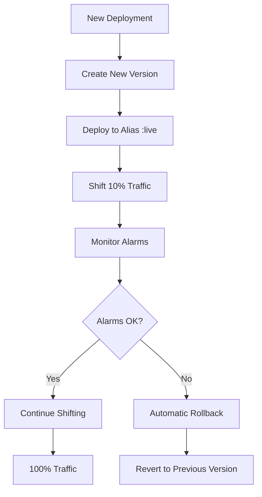

# Part IV:

## 1. Trace logs using X-Ray

AWS X-Ray provides distributed tracing for your serverless applications, allowing you to analyze and debug performance issues across your entire request flow. The atlantis-starter-02 template automatically configures X-Ray tracing for both API Gateway and Lambda functions.

### X-Ray Configuration in the Application Template

The SAM application template enables X-Ray tracing through several key configurations:

> NOTE: These are examples, the actual implementation may differ.

**Global X-Ray Settings:**
```yaml
Globals:
  Api:
    TracingEnabled: !If [ IsNotDevelopment, True, False] # X-Ray enabled for TEST and PROD
  Function:
    Tracing: !If [ IsNotDevelopment, "Active", !Ref 'AWS::NoValue'] # X-Ray enabled for TEST and PROD
```

**Cache-Data X-Ray Integration:**
```yaml
Environment:
  Variables:
    CACHE_DATA_AWS_X_RAY_ON: !If [ IsNotDevelopment, True, False] # Enable X-Ray tracing for Cache-Data operations
```

X-Ray tracing is automatically enabled for TEST and PROD environments but disabled for DEV.

### Reading and Interpreting X-Ray Traces

Once your application is deployed with X-Ray enabled, you can view traces in the AWS X-Ray console:

1. **Access X-Ray Console:**
   - Navigate to AWS X-Ray in the AWS Console
   - Select "Traces" from the left navigation

2. **Understanding the Service Map:**
   - The service map shows the flow of requests through your application
   - Each service appears as a node (API Gateway, Lambda, DynamoDB, S3, External APIs)
   - Connections show the request flow and response times
   - Color coding indicates health: green (normal), yellow (high latency), red (errors)

3. **Analyzing Individual Traces:**
   - Click on a trace to see the detailed timeline
   - Each segment represents a service call with timing information
   - Subsegments show internal operations (cache lookups, external API calls)
   - Error segments are highlighted in red with error details

4. **Key Metrics to Monitor:**
   - **Response Time:** Total time from API Gateway to response
   - **Lambda Duration:** Time spent in your Lambda function
   - **Cache Performance:** DynamoDB and S3 access times via Cache-Data
   - **External API Calls:** Time spent calling remote services
   - **Cold Start Impact:** Initialization time for new Lambda instances

### Tracing Cache-Data Operations

The Cache-Data package automatically creates X-Ray subsegments when `CACHE_DATA_AWS_X_RAY_ON` is enabled. 

You'll see:
- DynamoDB cache lookups
- S3 operations for large cached items
- External API calls made through Cache-Data

## 2. Monitor performance using Lambda Insights

AWS Lambda Insights provides enhanced monitoring capabilities for your Lambda functions, while CloudWatch Dashboards offer customizable visualizations of your application's performance metrics. The atlantis-starter-02 template automatically configures both for comprehensive observability.

### Lambda Insights Setup and Configuration

Lambda Insights is automatically enabled in the SAM template through AWS-managed layers:

**Architecture-Specific Layer Configuration:**
```yaml
Layers:
  # Lambda Insights layers vary by region and architecture
  - !If
    - IsArmArch
    - !FindInMap [LambdaInsightsArm, !Ref 'AWS::Region', ExtArn]
    - !FindInMap [LambdaInsightsX86, !Ref 'AWS::Region', ExtArn]
```

**IAM Permissions:**
```yaml
ManagedPolicyArns:
  - 'arn:aws:iam::aws:policy/CloudWatchLambdaInsightsExecutionRolePolicy'
```

The template includes mappings for multiple regions and both x86_64 and arm64 architectures, ensuring Lambda Insights works regardless of your deployment configuration.

### Key Lambda Insights Metrics

Lambda Insights automatically collects and displays several critical metrics:

1. **Performance Metrics:**
   - **Duration:** Function execution time
   - **Memory Utilization:** Actual memory used vs. allocated
   - **CPU Utilization:** Processor usage during execution
   - **Network Activity:** Bytes sent/received

2. **Operational Metrics:**
   - **Cold Starts:** Frequency and duration of initialization
   - **Concurrent Executions:** Number of simultaneous function instances
   - **Throttles:** Rate limiting events
   - **Errors:** Function failures and their causes

3. **Cost Optimization Insights:**
   - **Over-provisioned Memory:** Identify functions with excess memory allocation
   - **Under-utilized Functions:** Functions that could benefit from optimization
   - **Cost per Invocation:** Financial impact of function performance

### Accessing Lambda Insights

1. **Via Lambda Console:**
   - Navigate to your Lambda function in the AWS Console
   - Click the "Monitoring" tab
   - Select "Lambda Insights" to view enhanced metrics

2. **Via CloudWatch:**
   - Go to CloudWatch → Insights → Lambda Insights
   - View aggregated metrics across all your Lambda functions
   - Use filters to focus on specific functions or time periods

## 3. Monitor performance using CloudWatch Dashboards

The atlantis-starter-02 template includes a comprehensive CloudWatch dashboard that's automatically created for PROD environments:

The application's `template.yml` imports the dashboard definition from `template-dashboard.yml`:

`template.yml`: 
```yaml
  # -- CloudWatch Dashboard --

  Fn::Transform:
    Name: AWS::Include
    Parameters:
      Location: ./template-dashboard.yml
```

`template-dashboard.yml`:
```yaml
Dashboard:
  Type: AWS::CloudWatch::Dashboard
  Condition: CreateProdResources
  Properties:
    DashboardName: 
      Fn::Sub: '${Prefix}-${ProjectId}-${StageId}-Dashboard'
    DashboardBody: 
      Fn::Sub: 
        |
        { 
          "widgets": [
             # ... Dashboard body in JSON format ...
          ]
        }
```

> NOTE: Since CloudWatch dashboards cost money, and they are only really useful in production, the template conditionally deploys a dashboard when `DeployEnvironment` is set to `PROD`.

To view your application's dashboard you will need to go to a `beta` or `prod` application stack in the CloudFormation web console and find the link to the dashboard under the "Outputs" section.

### Dashboard Widget Categories

The pre-configured dashboard includes several widget categories:

#### 1. Core Performance Metrics

- Lambda invocations and errors over time
- Function duration (average, minimum, maximum)
- Concurrent executions
- API Gateway latency and error rates

#### 2. Error Monitoring

- Lambda function errors
- API Gateway 4XX and 5XX errors
- Alarm status indicators

#### 3. Memory and Performance Analysis

- Memory usage table

Don't worry if you are over provisioned, higher memory allocation equals faster network and execution. For most applications, allocating up to 2GB is sufficent. Run your application at different memory allocations and see how performance improves or degrades.

Each application is different, and there is a point where increasing memory doesn't decrease execution time, therby increasing cost.

#### 4. Duration Distribution Analysis

- Execution time buckets (50ms, 100-250ms, 250-500ms, etc.)
- Performance trend identification
- Outlier detection

If you have allocated too little memory (less than 1GB) you may see longer execution times. Try increasing memory, viewing logs and X-Ray traces to see if there are slow endpoints (to add/increase caching), or examine your code to see if there are processes you can parallelize.

#### 5. Cache Performance Monitoring
- External endpoint request duration
- Cache hit/miss rates

Evaluate how long it takes to get fresh data, the hit/miss rates, and adjust your cache expiration to improve execution time.

If you have long lived data with a high miss rate, think about increasing the expiration time, especially if the external endpoint is slow.

#### 6. Cold Start Analysis
- Cold start frequency and duration
- Initialization performance tracking
- Impact on overall response times

#### 7. Request Analysis
- Route usage patterns
- Query parameter analysis
- API key usage statistics

### Performance Monitoring Best Practices

**1. Memory Optimization:**
- Monitor the "Memory" widget to identify over-provisioned functions
- Look for consistent patterns where `maxMemoryUsedMB` is significantly less than `provisonedMemoryMB`
- Adjust Lambda memory allocation based on actual usage patterns

**2. Duration Analysis:**
- Use the "Durations" widget to identify performance bottlenecks
- Look for requests consistently falling into higher duration buckets
- Investigate functions with high maximum duration values

**3. Cache Effectiveness:**
- Monitor cache hit/miss ratios in the "Cache Utilization" widgets
- Identify endpoints with poor cache performance
- Adjust cache policies based on utilization patterns

**4. Cold Start Management:**
- Track cold start frequency in the "Cold Starts" widget
- Consider provisioned concurrency for functions with frequent cold starts
- Monitor initialization duration for optimization opportunities

**5. Error Pattern Recognition:**
- Use the "Error and Warning Log" widget to identify recurring issues
- Set up alerts for error rate thresholds
- Correlate errors with specific routes or time periods

### Dashboard Access and Sharing

**Accessing Your Dashboard:**
The template automatically provides a direct link in the CloudFormation outputs:
```yaml
CloudWatchDashboard:
  Description: "Cloud Watch Dashboard (for production environments only)"
  Value: !Sub 'https://console.aws.amazon.com/cloudwatch/home?region=${AWS::Region}#dashboards:name=${Dashboard}'
```

### Cost Considerations

**Dashboard Costs:**
- CloudWatch dashboards cost $3 per dashboard per month
- Custom metrics cost $0.30 per metric per month
- Log queries are charged based on data scanned

**Optimization Strategies:**
- Use the `CreateProdResources` condition to limit dashboards to production
- Implement log retention policies to control storage costs
- Use sampling for high-volume metrics when appropriate

### Troubleshooting Dashboard Issues

**Missing Data:**
- Verify Lambda Insights layer is properly attached
- Check IAM permissions for CloudWatch access
- Ensure log groups exist and have proper retention settings

**Query Performance:**
- Optimize log queries by adding time range filters
- Use specific field filters to reduce data scanning
- Consider using CloudWatch Insights for complex analysis

**Widget Configuration:**
- Validate metric names and dimensions
- Check region consistency across widgets
- Ensure proper JSON formatting for custom widgets

## 3. Create Alarms and Rollbacks

CloudWatch Alarms provide automated monitoring and alerting for your serverless application, while AWS SAM's gradual deployment features enable automatic rollbacks when issues are detected. The atlantis-starter-02 template implements both capabilities to ensure reliable deployments and rapid issue detection.

### CloudWatch Alarm Configuration

The template creates alarms that are automatically integrated with the deployment process.

In your application's template look for the following resource types:

- `AWS::CloudWatch::Alarm`
- `AWS::SNS::Topic`

There will be at least two alarms, one for the Lambda function and another for API Gateway.

When you deploy the stack, you'll receive an email confirmation for the alarm subscription. You must confirm this subscription to receive alarm notifications. This is generated by the `AWS::SNS::Topic` resource.

### Gradual Deployment Configuration

The template implements gradual deployments for your Lambda function with automatic rollback capabilities:

**Deployment Preference Settings:**
```yaml
DeploymentPreference:
  Enabled: !If [ IsProduction, True, False]  # Only in PROD
  Type: !If [ IsProduction, !Ref FunctionGradualDeploymentType, "AllAtOnce"]
  Role: !Ref DeployRole
  Alarms:
    Fn::If:
      - CreateAlarms
      - - !Ref AppFunctionErrorsAlarm
      - - !Ref 'AWS::NoValue'
```

**Available Deployment Types:**
- `Canary10Percent5Minutes`: Deploy 10% of traffic, wait 5 minutes, then 100%
- `Canary10Percent10Minutes`: Deploy 10% of traffic, wait 10 minutes, then 100%
- `Linear10PercentEvery1Minute`: Deploy 10% every minute for 10 minutes
- `Linear10PercentEvery3Minutes`: Deploy 10% every 3 minutes for 30 minutes
- `AllAtOnce`: Immediate full deployment (used for DEV/TEST)

### How Gradual Deployment Works

**Traffic Shifting Process:**

```mermaid
graph TD
    A[New Deployment] --> B[Create New Version]
    B --> C[Deploy to Alias :live]
    C --> D[Shift 10% Traffic]
    D --> E[Monitor Alarms]
    E --> F{Alarms OK?}
    F -->|Yes| G[Continue Shifting]
    F -->|No| H[Automatic Rollback]
    G --> I[100% Traffic]
    H --> J[Revert to Previous Version]
```

## 4. Create unit tests and automate pre-deployment testing

Unit testing is a critical component of maintaining reliable serverless applications. The atlantis-starter-02 template includes a comprehensive testing framework using Jest that automatically runs during the build process to catch issues before deployment.

### Understanding the Existing Test Structure

The reference implementation includes a well-organized test suite that demonstrates testing patterns for different application components:

**Test Directory Structure:**
```
src/
├── tests/
│   └── index.mjs          # Main test file with comprehensive examples
├── models/
│   ├── sample-data/       # Input data for testing
│   └── test-data/         # Expected output data for validation
├── jest.config.js         # Jest configuration
└── package.json           # Test scripts and dependencies
```

### Running Tests Locally

**Execute Tests During Development:**
```bash
# Navigate to the source directory
cd application-infrastructure/src

# Install dependencies (including dev dependencies)
npm install --include=dev

# Run all tests
npm test

# Run specific test files
npx jest tests/controllers.test.mjs

# Run tests in watch mode during development
npx jest tests/**/*.mjs --watch
```

### Test Coverage and Quality Guidelines

**1. Coverage Targets:**
- Aim for 80%+ code coverage on business logic
- 100% coverage on validation functions
- Focus on critical paths and error handling

**2. Test Quality Principles:**
- Each test should verify one specific behavior
- Use descriptive test names that explain the expected behavior
- Include both positive and negative test cases
- Test edge cases and boundary conditions

**3. Test Organization:**
- Group related tests using `describe` blocks
- Use `beforeEach` and `afterEach` for test setup and cleanup
- Keep tests independent - each test should be able to run in isolation

**4. Assertion Best Practices:**
```javascript
// Good: Specific assertions with clear error messages
expect(result.statusCode, 'HTTP status should be 200').to.equal(200);
expect(result.body, 'Response body should be valid JSON').to.be.a('string');

// Good: Deep equality checks for objects
expect(result.data).to.deep.equal(expectedData);

// Good: Property existence and type checking
expect(result).to.have.property('items').that.is.an('array');
```

This comprehensive unit testing approach ensures that your serverless application components are thoroughly validated before deployment, catching issues early in the development cycle and maintaining code quality as your application evolves.

## 5. Automated Testing Strategies

Automated testing in serverless applications involves multiple layers: pre-deployment testing during the build process, and post-deployment testing to validate the live environment. The atlantis-starter-02 template implements comprehensive automated testing strategies that ensure code quality and system reliability.

### Pre-Deployment Testing in BuildSpec

The buildspec.yml file orchestrates automated testing as part of the CI/CD pipeline, ensuring that no code reaches production without passing comprehensive tests.

**BuildSpec Testing Flow:**
```yaml
phases:
  pre_build:
    commands:
      # Install dependencies including dev dependencies for testing
      - cd application-infrastructure/src
      - npm install --include=dev
      
      # Run comprehensive test suite
      - npm test
      
      # Remove dev dependencies for production deployment
      - npm prune --omit=dev
      
      # Security audit - fail build if high vulnerabilities found
      - npm audit fix --force
      - npm audit --audit-level=high
```

**Why This Approach Works:**

1. **Early Failure Detection:** Tests run before any deployment artifacts are created
2. **Clean Production Environment:** Dev dependencies are removed after testing
3. **Security Validation:** Automated vulnerability scanning prevents insecure deployments
4. **Build Artifact Integrity:** Only tested, clean code proceeds to deployment

### Comprehensive Pre-Deployment Test Strategy

**1. Multi-Layer Test Execution:**

The automated testing strategy should include multiple test types executed in sequence:

```bash
# Example enhanced test script in package.json
{
  "scripts": {
    "test": "npm run test:lint && npm run test:unit && npm run test:integration",
    "test:lint": "eslint src/**/*.js --fix",
    "test:unit": "mocha --recursive ./tests/unit/**/*.mjs",
    "test:integration": "mocha --recursive ./tests/integration/**/*.mjs",
    "test:security": "npm audit --audit-level=high",
    "test:coverage": "nyc npm run test:unit"
  }
}
```

### Integration Testing Examples

Integration tests validate that different components work together correctly.

### Post-Deployment Testing

Post-deployment testing validates that the deployed application works correctly in the live environment.

You can add a `buildspec-postdeploy.yml` (similar to `buildspec.yml` but only runs tests) and reconfigure your pipeline to run a post deploy phase.

### Manual Testing

Beyond checking in the browser, you can set up an API development application such as Postman or Insomnia with a predefined set of testing suites or endpoint checks.

### Automated Post-Deployment Testing in the Post-Deploy Buildspec

Integrate post-deployment testing into your CI/CD pipeline:

**Enhanced BuildSpec with Post-Deployment Testing:**
```yaml
phases:
  post_build:
    commands:

      - export STACK_NAME="${PREFIX}-${PROJECT_ID}-${STAGE_ID}-application"

      # Get outputs
      - |
        REST_API_ID=$(aws cloudformation describe-stack-resource--stack-name "${STACK_NAME}" --logical-resource-id "WebApi" --query "StackResourceDetail.PhysicalResourceId" --output text) 
        
      # Run post-deployment tests
      - cd application-infrastructure/src
      - npm install --include=dev
      - npm run test:post-deployment
      
      # Clean up test dependencies
      - npm prune --omit=dev

    finally:
      # Always run cleanup, even if tests fail
      - echo "Post-deployment testing completed"
```

This comprehensive automated testing strategy ensures that your serverless application is thoroughly validated at every stage of the deployment pipeline, from code commit to production deployment, maintaining high quality and reliability standards.

## 6. Clean Up

To avoid ongoing charges to your AWS account, delete the resources created in this tutorial.

> Note: This step is optional and is dependent upon your user permissions and whether or not you wish or are required to delete the stacks created in this tutorial. It is recommended, for practice and if you have the proper permissions, to delete your "PROD" (beta and prod) stages. This helps reduce cost and re-enforce your knowledge of stack management. You can always go through the steps of creating and deploying the stage later. That's the nice thing about automation!

The `delete.py` script is provided to perform clean-up operations in proper order.

As the accidental deletion of stacks can be devastating, the delete script requires several confirmation steps.

You will be required to provide the ARNs for both the pipeline and application stack. You may obtain these from the Stack Info tab in the CloudFormation web console.

> Proceed with caution! Double check your work and make sure you are deleting the correct stack!

There are 2 manual steps that need to take place prior to running the delete script. Some organizations may restrict who can perform these steps to ensure proper checks and balances.

1. Manually add a tag to the pipeline stack with the key `DeleteOnOrAfter` and a value of a date in `YYYY-MM-DD` format. (Add `Z` to end for UTC. Example `2026-07-09Z`). This can be done using the AWS CLI:
	- `aws resourcegroupstaggingapi tag-resources --resource-arn-list "arn:aws:cloudformation:region:account:stack/stack-name/stack-id" --tags DeleteOnOrAfter=YYYY-MM-DD --profile your-profile`
	- Be sure to replace the ARN in the command with the pipeline stack ARN.
	- Successful completion will result in receiving an empty `FailedResourcesMap`
	- You can double check by going to the pipeline stack in the CloudFormation console.
2. Disable termination protection: `aws cloudformation update-termination-protection --stack-name STACK_NAME --no-enable-termination-protection`
    - Be sure to replace `STACK_NAME` with the name of the stack. You do not need the full ARN for this command.
	- Do this for both the `pipeline` and `application` stacks.

The delete script is now ready to be ran from the SAM config repository:

```bash
# Perform this command in the SAM Config Repo
./cli/delete.py pipeline acme tutorial-games-proxy beta --profile YOUR_PROFILE
```

You will have the chance to either retain the stage's environment settings in the `samconfig` file for later re-deployment, or to delete it completely. Once all stage environments of a `samconfig` file are deleted the file and directory for that project is also deleted.

Be sure to perform this operation for any unwanted stages of your application (`test`, `beta`, `prod`, etc.).

Performing the delete does not delete the repository. Since the size of the repository is minimal you will not incur charges and may leave the repository as-is for future reference.

Take care and double check to ensure you are deleting the right resources.

> If you accidentally delete the pipeline before the application, you can redeploy the pipeline, and then delete the application.

## Part IV Summary

Congrats! You have completed Tutorial #02! Now that you have used Serverless to deploy a fully functional web service that gathers data from multiple sources, utilizes organized code and classes, performs caching, and implements monitoring and observability, testing, and other best practices, you have the basis for many projects that will come your way.

- [Next Tutorial: Tutorial #03: Deploying a Static Website](../03-static-website-deployment/README.md)
- [Return to Tutorial 02 Introduction](./README.md)
- [All Tutorials](../../README.md)
