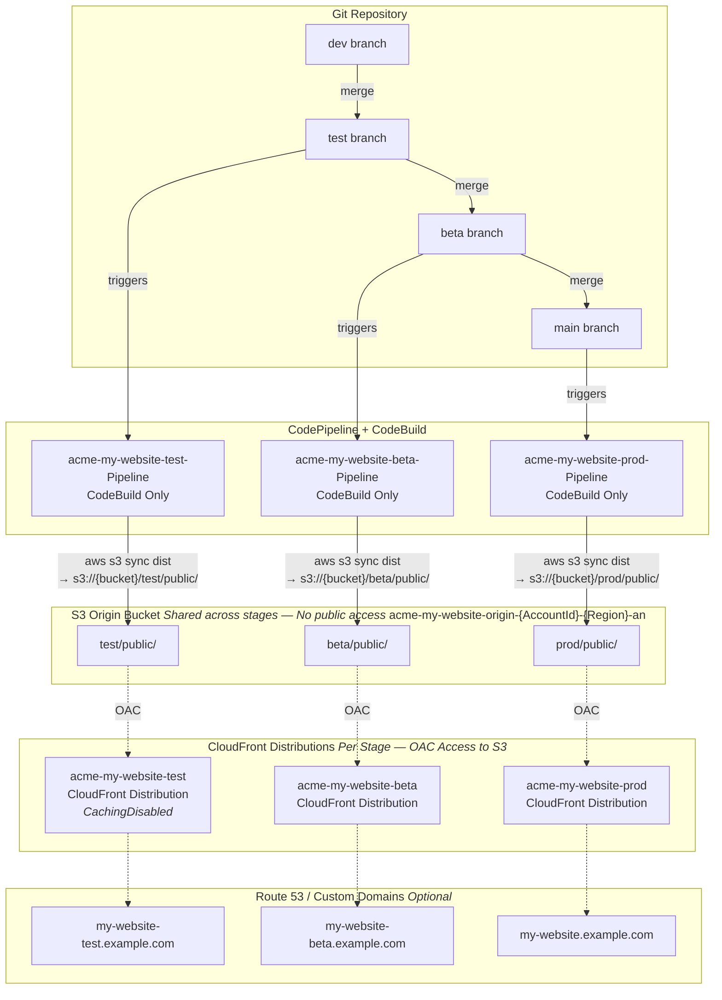

# Deploying a Static Website

> This tutorial is still under development. However, the basic structure is listed below. Please be advised that the content is short, may be missing, and may have inaccuracies or typos. If you would like to contribute updates, please submit an [issue via this repository on GitHub](https://github.com/63Klabs/atlantis-tutorials/issues). Be sure to include the page and what content should be added/updated. If you'd be willing to write a few sentences (or more, but be clear and succinct), please do. Thank you for your understanding.

[AWS Amplify](https://aws.amazon.com/amplify) is a powerful, managed solution for deploying websites. It is recommended for those who need a dead simple method of deploying a static website or web application as it handles the deployment, certificates, custom domains, hosting, and more for you.

**However**, if you want to get more hands-on with the development, configuration, and deployment of a static website using S3, a Pipeline, and CloudFront paired with Route53, use this tutorial to explore the solution.

## 1. reate Your Repository
From the SAM Config repository:

```bash
./cli/create_repo.py your-repo-name --profile default
# Choose 'None' for seeding
```

Clone your repository, create a dev branch, and then scaffold it with React (or your framework of choice):

```bash
npm create vite@latest my-website -- --template react
cd my-website
npm install
npm run dev
```

View your site on the local machine by going to the provided `localhost`/`127.0.0.1` URL.

In the `my-website` directory, create a buildspec file with commands that will build and then copy the contents of the build to S3.

```yaml
version: 0.2
# my-website/buildspec.yml

phases:
  install:
    runtime-versions:
      nodejs: latest
      python: latest
    commands:

      - ls -l -a

      # Build Environment information for debugging purposes
      - python3 --version
      - node --version
      - aws --version
      - echo "NODE_ENV is $NODE_ENV"

      # Set npm caching (This 'offline' cache is still tar zipped, but it helps.) - https://blog.mechanicalrock.io/2019/02/03/monorepos-aws-codebuild.html
      - npm config -g set prefer-offline true
      - npm config -g set cache /root/.npm
      - npm config get cache

  pre_build:
    commands:
      
      # Application Environment: Install NPM dependencies needed for application environment
      - ls -l -a
      - cd my-website
      - npm install --production

      # FAIL the build if npm audit has vulnerabilities it can't fix
      # Perform a fix to move us forward, then check to make sure there were no unresolved high fixes
      - npm audit fix --force
      - npm audit --audit-level=high
      
  build:
    commands:

	  - npm run build

	  # S3_STATIC_HOST_BUCKET and STAGE_ID are environment variables in our CodeBuild deployment
	  - aws s3 sync dist "s3://${S3_STATIC_HOST_BUCKET}/${STAGE_ID}/public/" --delete

      # list files in the build
	  - cd dist # sometimes build/
      - ls -l -a

# add cache
cache:
  paths:
    - '/root/.npm/**/*'
```

Commit and push your code to the `dev` branch. Then merge and push into `test`.

## 2. Configure and Deploy an S3 Bucket for Hosting

The S3 Bucket will be shared among all your deployments for your project (`test`, `beta`, `prod`) so you will not need to specify a `StageId`.

From the SAM Config repository:

```bash
./cli/config.py storage acme my-website --profile default
./cli/deploy.py storage acme my-website --profile default
# Make note of the S3 bucket name AND S3 bucket domain
```

If you check the contents of your S3 bucket you'll see that it is empty. However, as you add and run deployment pipelines, the following structure will emerge:

```
|- test/public
|- beta/public
|- prod/public
```

This S3 bucket will be shared among all the `StageId`s of your site and each will be mapped to its own CloudFront distribution which we will create after the pipeline.

Organizations used to serve objects directly from S3 using a Static Web Hosting option. However, that is no longer the best practice.

Today, modern best practices are to create an S3 bucket, keep it out of public view, and place CloudFront in front of it. The storage template you deployed locks access to the bucket and only allows public access through CloudFront. This is called "Object Access Control" or OAC.

View the [template-storage-s3-oac-for-cloudfront.yml](https://github.com/63Klabs/atlantis-sam-templates/blob/main/templates/v2/storage/template-storage-s3-oac-for-cloudfront.yml) on GitHub to see how the bucket is defined.

## 3. Configure and Deploy your `test` Pipeline to Build and Copy Your Content to S3

Now that we have S3 set up, we can set up the CI/CD pipeline to build and copy the files over.

From the SAM Config repository:

```bash
./cli/config.py pipeline acme my-website test --profile default
# - Use CodeBuild Only Pipeline
# - For Static Host bucket use the S3 bucket name
./cli/deploy.py pipeline acme my-website test --profile default
```

After the pipeline has deployed, use the Output link to see it in action. Check for any errors and follow along in the CodeBuild console as it builds and copies your site to S3.

Once the deployment has finished, go to the S3 console and view the contents of your S3 bucket. You should see `test/public/<your-files>`

## 4. Configure and Deploy the `test` CloudFront Distribution (Route53 optional)

We will now create the CloudFront Distribution that uses your bucket with the `test/public` object prefix as an origin.

From the SAM Config repository:

```bash
./cli/config.py network acme my-website test --profile default
# - There are a lot of parameters, for most you will accept the defaults
# - Use S3 Bucket Origin Domain from storage output
# - A custom domain for Route53 is optional, you can just use the provided CloudFront domain for the tutorial and development
./cli/deploy.py network acme my-website test --profile default
```

From the output section you should see the CloudFront distribution domain. Follow the link and you should see your site.

## 5. Add `beta` and `prod`

Go through the same steps above, this time creating a `beta` and `prod` deployment.

You may need to add a `beta` branch to your repository.

## 6. Architecture Overview

Below is the final architecture diagram of what we build in this tutorial.



Here's what it shows:

- **Git Repository**: The dev → test → main branch merge strategy
- **Pipelines**: Each stage (test, beta, prod) gets its own CodeBuild-only pipeline, triggered by its corresponding branch
- **S3 Origin Bucket**: A single shared bucket (no StageId in the name) with {StageId}/public/ prefixes isolating each stage's content. CodeBuild syncs build output here. No public access.
- **CloudFront Distributions**: One per stage, using Origin Access Control (OAC) to read from the corresponding S3 prefix. Test/dev environments use CachingDisabled.
- **Route 53 / Custom Domains**: Optional custom domains — non-prod stages get a stage suffix (e.g., my-website-test.example.com), while prod uses the clean subdomain

## 7. Advanced Concepts

As you deployed the CloudFormation distribution, you may have noticed the ability to add an API Gateway as an endpoint alongside the static website.

This would provide a site map such as:

```
|- /    <-- uses S3 as origin
|- /api <-- uses API Gateway as origin
```

The S3 origin would map to `s3://yourbucket/test/public/*

The API Gateway origin would map to `apigwid.execute-api.us-east-2.amazonaws.com/acme-my-api-test/*`

So, if your API Gateway Endpoint was:

```
apigwid.execute-api.us-east-2.amazonaws.com/acme-my-api-test/v1/users
```

The CloudFront location would be:

```
distid.cloudfront.net/api/v1/users
```

And static content would be:

```
distid.cloudfront.net/
```

### 7.1 Deploy an API Behind CloudFront

1. In the SAM Config repository, use the `create_repo.py` script to create a new serverless application repository seeding it with Atlantis Starter 00 Basic Node.js
2. `clone` the repo to your machine and `merge` the `dev` branch into `test`, and `push`.
3. Use `config.py pipeline` and `deploy.py pipeline` to create a pipeline for your `test` branch. You **must** name the project with the SAME `ProjectId` as your website project.
4. After the pipeline has deployed, and you have checked that your application is reachable, re-configure and deploy the `network` stack.
5. Use `config.py network` and `deploy.py network` to add the API Gateway ID to the `test` CloudDistribution.

Once the distribution has deployed, you should be able to access your endpoint using the distribution URL.

### 7.2 Display Your API Content on Your Site

Modify your web site to fetch data from the endpoint and display it on your site.

## 8. Clean-Up

To avoid ongoing charges to your AWS account, delete the resources created in this tutorial.

> Note: This step is optional and is dependent upon your user permissions and whether or not you wish or are required to delete the stacks created in this tutorial. It is recommended, for practice and if you have the proper permissions, to delete at least one of your stages. This helps enforce your knowledge and you can always go through the steps of creating and deploying the stage later. That's the nice thing about automation!

The `delete.py` script is provided to perform clean-up operations in proper order.

As the accidental deletion of stacks can be devastating, the delete script requires several confirmation steps.

You will be required to provide the ARN for each stack you delete. You may obtain these from the Stack Info tab in the CloudFormation web console.

We will delete:

- `prod` pipeline stack
- `prod` network stack
- `beta` pipeline stack
- `beta` network stack
- `test` pipeline stack
- `test` network stack
- `test` application and pipeline stacks
- shared storage stack

> Proceed with caution! Double check your work and make sure you are deleting the correct stack!

There are 2 manual steps that need to take place **ON EACH STACK** prior to running the delete script. Some organizations may restrict who can perform these steps to ensure proper checks and balances.

1. Manually add a tag to the stack with the key `DeleteOnOrAfter` and a value of a date in `YYYY-MM-DD` format. (Add `Z` to end for UTC. Example `2026-07-09Z`). This can be done using the AWS CLI:
  - `aws resourcegroupstaggingapi tag-resources --resource-arn-list "arn:aws:cloudformation:region:account:stack/stack-name/stack-id" --tags DeleteOnOrAfter=YYYY-MM-DD --profile your-profile`
  - Be sure to replace the ARN in the command with the pipeline stack ARN.
  - Successful completion will result in receiving an empty `FailedResourcesMap`
  - You can double check by going to the pipeline stack in the CloudFormation console.
2. Disable termination protection: `aws cloudformation update-termination-protection --stack-name STACK_NAME --no-enable-termination-protection`
    - Be sure to replace `STACK_NAME` with the name of the stack. You do not need the full ARN for this command.
  - Do this for each `pipeline`, `network`, and `storage` stack you wish to delete.

The delete script is now ready to be ran from the SAM config repository:

```bash
# Perform this command in the SAM Config Repo
./cli/delete.py pipeline acme my-website beta --profile default
```

You will have the chance to either retain the stage's environment settings in the `samconfig` file for later re-deployment, or to delete it completely. Once all stage environments of a `samconfig` file are deleted the file and directory for that project is also deleted.

Be sure to perform this operation for any unwanted stages of your site (`test`, `beta`, `prod`, etc.).

Performing the delete does not delete the repository. Since the size of the repository is minimal you will not incur charges and may leave the repository as-is for future reference.

## Summary

Congratulations! You have completed Tutorial #03! You have successfully deployed a static website using an automated CI/CD pipeline.

You can now use this knowledge to deploy more complex applications and services using the same principles and techniques.

- [Next Tutorial: Tutorial #2: Advanced API Gateway and Lambda using Cache-Data (Node)](./../02-advanced-api-gateway-lambda-cache-data-node/README.md)
- [All Tutorials](../../README.md)