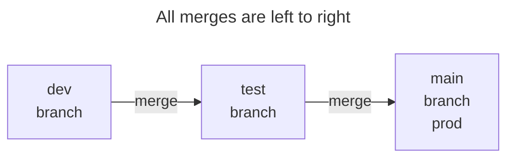
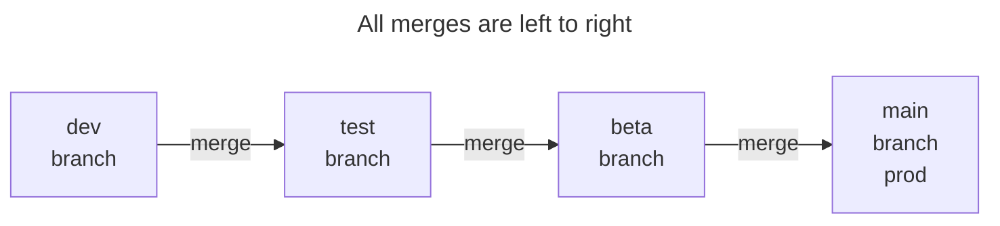
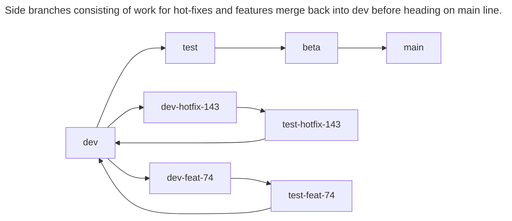

# Branching and Git Workflow Strategy for Tutorials

You'll notice your repositories are initially created with 3 branches:

- `dev` (for constant commits of unfinished code)
- `test` (for automated deployments to test)
- `main` (default and for automated deployments to production)

When we initially create the repository, the `main` and `test` branches only include a single placeholder file. This is because we haven't had any finished code to deploy.

The repositories are set up using a simplified `dev-test-main` workflow where a developer can continually commit and push changes to the `dev` branch without invoking an automated deployment. Since continually running an AWS CodePipeline can incur cost, code is only merged and pushed to `test` when it is ready to deploy to a test instance.



If changes need to be made, go back and check-out the `dev` branch, make changes, commit and push to `dev`, then merge and push to `test`. This cycle continues until the code in `test` is deemed ready for production.

Once ready for production, the `test` branch is merged and pushed into `main` which kicks off a deployment for production.

To complete the cycle, a developer may wish to merge main into dev just to ensure no side branches (feature or hotfix) were merged that have not been received into `dev`.

If a staging or beta branch is desired, it can be inserted in between `test` and `main`. (`dev-test-beta-main` or `dev-test-stage-main`).



We will be using this branch workflow strategy for the tutorials as diving into feature, hot-fix, etc. is beyond the scope of these tutorials. Your Git workflow strategy depends on your organization, how many developers are working on a repository, and your needs. Outside of the tutorials, you can reconfigure, use different strategies, and point a pipeline to any branch, including `feat-328` or `fix-98`. At the end of the day all you need is a branch or two that can receive a commit to kick off a deployment pipeline.

## Example

> We will use the more modern `switch` command rather than `checkout` for changing between branches. If you prefer `checkout` you may use that instead of `switch`. If you are new to git, then use `switch`.

Switch to the `dev` branch.

```bash
git switch dev
# do a git pull if there were, or could be, changes since you last worked
git pull
```

Make edits to your code and continually push your changes to the `dev` branch to save your work to the remote repository. (This allows you to revert if needed)

```bash
git add --all
git commit -m "short but descriptive message"
git push
```

After you are ready to deploy to test, merge and push `dev` branch to `test`.

```bash
git switch test
git merge dev
git push
```

When `test` is connected to a pipeline, the pipeline will go through the deploy process and you can test the deployment.

If changes need to be made, go back and check-out the `dev` branch and make your changes. When ready, merge changes into `test`.

```bash
git switch dev
# make your code changes
git add --all
git commit -m "short but descriptive message"
git push
# when ready for another deploy to test...
git switch test
git merge dev
git push
# go back to dev if more changes are needed
```

Once the test instance receives approval to move to production, merge and push to the production `main` branch. We won't worry about pull requests for the tutorials.

```bash
git switch main
git merge test
git push
```

Go back to `dev` to begin your next round of code changes.

```bash
git switch dev
```

At the start of the day (and perhaps throughout if multiple people are working on the repository) do a git pull on `dev` and `main` and merge `main` into `dev`.

```bash
git switch main 
git pull # get any changes from main
git switch dev
git pull # make sure dev is up to date
git merge main # bring any changes from main down into dev
git push
```

## Accommodating More Complex Workflows

While this is beyond the scope of most of these tutorials, if multiple features are being worked on at the same time, there can be side branches. Much like trains moving from a side branch to the mainline, communication among team members to make sure the mainline is clear is key.

All work starts from dev, and dev can be regularly merged into side branches to keep them up to date. However, side branches can only merge into dev when work on those side branches are complete and given the all-clear to merge back into dev.

Temporary pipelines can be set up on any branch used for testing and assist in making sure working code is merged back into dev.

In this instance, dev does not hold daily work, but instead working code.



Another option instead of creating and destroying feature branches is to give each developer their own dev and test branch (dev-joe and test-joe) with the same principle that only working code is merged into dev.
